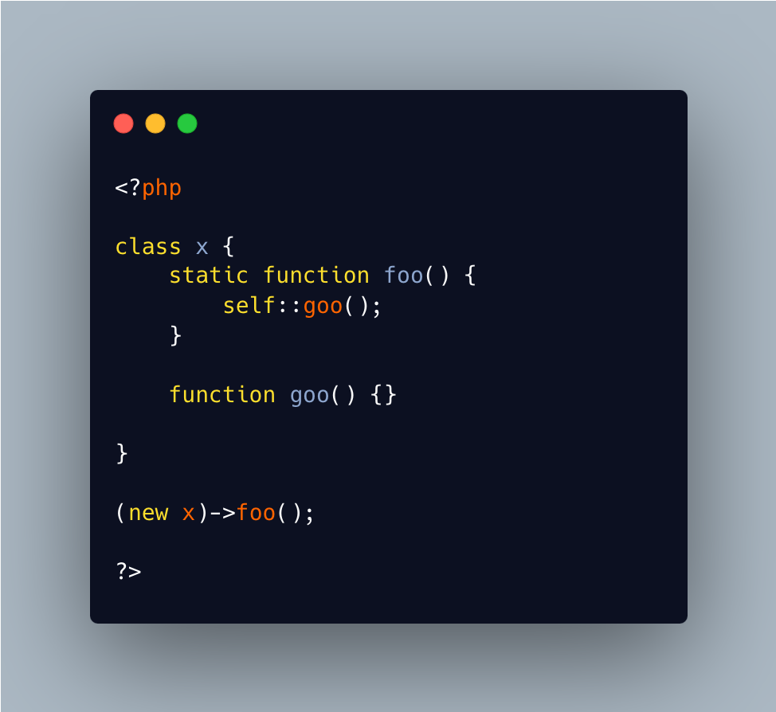

.. _a-static-method-cannot-call-a-non-static-method:

A Static Method Cannot Call A Non Static Method
-----------------------------------------------

.. meta::
	:description:
		A Static Method Cannot Call A Non Static Method: It is known that a non-static method can call a static method.
	:twitter:card: summary_large_image
	:twitter:site: @exakat
	:twitter:title: A Static Method Cannot Call A Non Static Method
	:twitter:description: A Static Method Cannot Call A Non Static Method: It is known that a non-static method can call a static method
	:twitter:creator: @exakat
	:twitter:image:src: https://php-tips.readthedocs.io/en/latest/_images/static_cannot_call_non_static.png
	:og:image: https://php-tips.readthedocs.io/en/latest/_images/static_cannot_call_non_static.png
	:og:title: A Static Method Cannot Call A Non Static Method
	:og:type: article
	:og:description: It is known that a non-static method can call a static method
	:og:url: https://php-tips.readthedocs.io/en/latest/tips/static_cannot_call_non_static.html
	:og:locale: en

.. raw:: html

	

It is known that a non-static method can call a static method. It is less known that a static method cannot call a non-static method, even if the static syntax is possible.

A non-static method needs a value for ``$this``, which a static call doesn't provide.

