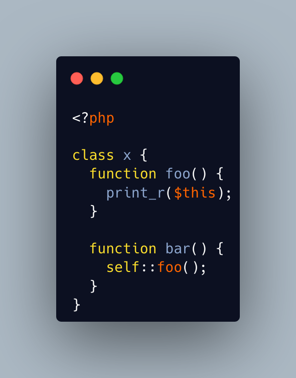

.. _get-$this-in-a-static:

Get $this In A Static
---------------------

.. meta::
	:description:
		Get $this In A Static: A static method does not have access to the current object, by definition.
	:twitter:card: summary_large_image
	:twitter:site: @exakat
	:twitter:title: Get $this In A Static
	:twitter:description: Get $this In A Static: A static method does not have access to the current object, by definition
	:twitter:creator: @exakat
	:twitter:image:src: https://php-tips.readthedocs.io/en/latest/_images/static_get_this.png
	:og:image: https://php-tips.readthedocs.io/en/latest/_images/static_get_this.png
	:og:title: Get $this In A Static
	:og:type: article
	:og:description: A static method does not have access to the current object, by definition
	:og:url: https://php-tips.readthedocs.io/en/latest/tips/static_get_this.html
	:og:locale: en

.. raw:: html

	

A static method does not have access to the current object, by definition.

It is also possible to call statically any method within a class. 

But when a static method calls a non-static method, an error is produced:  Non-static ``method x::foo()`` cannot be called statically.

Finally, calling statically a non-static method still defines ``$this`` in the target method. Static is the nature of the method, not the call.

See Also
________

* `Static Keyword (PHP manual) <https://www.php.net/manual/en/language.oop5.static.php>`_
* `internal static and external static <https://3v4l.org/hLtMb>`_

