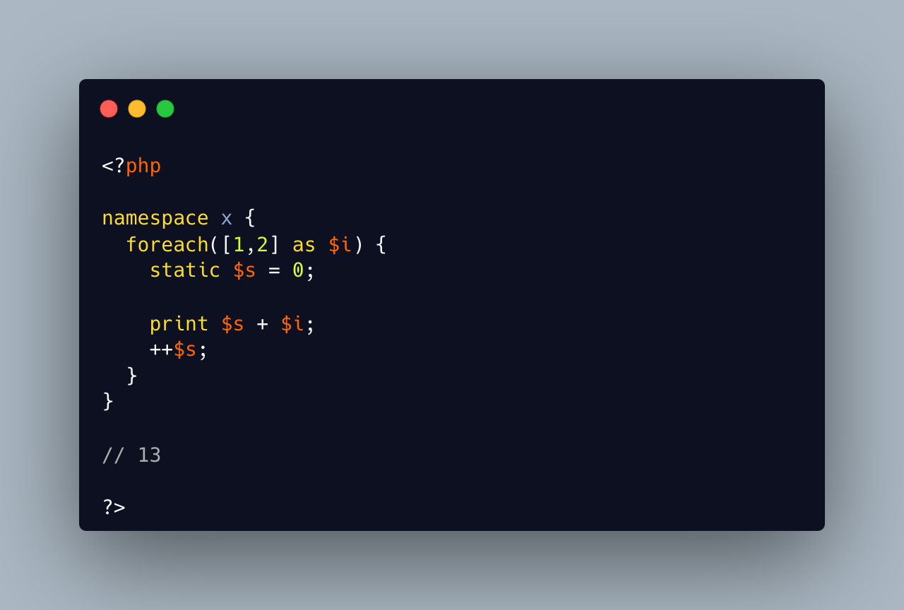

.. _static-variable-outside-a-method:

Static Variable Outside A Method
--------------------------------

.. meta::
	:description:
		Static Variable Outside A Method: TIL that PHP static variables can be declared out of a function, in the namespace.
	:twitter:card: summary_large_image
	:twitter:site: @exakat
	:twitter:title: Static Variable Outside A Method
	:twitter:description: Static Variable Outside A Method: TIL that PHP static variables can be declared out of a function, in the namespace
	:twitter:creator: @exakat
	:twitter:image:src: https://php-tips.readthedocs.io/en/latest/_images/static_outside_method.png
	:og:image: https://php-tips.readthedocs.io/en/latest/_images/static_outside_method.png
	:og:title: Static Variable Outside A Method
	:og:type: article
	:og:description: TIL that PHP static variables can be declared out of a function, in the namespace
	:og:url: https://php-tips.readthedocs.io/en/latest/tips/static_outside_method.html
	:og:locale: en

.. raw:: html

	

TIL that PHP static variables can be declared out of a function, in the namespace.

Then, it is a simple variable with a default value. There is no way to call the global scope again (that makes no sense). In fact, including the same file simply restarts the context and the static variable again. 

May be a warning from the linter could be nice.

In PHP 8.3, duplicate 'static' variable definitions is forbidden. Not in a loop, which is a bad practice anyway.

See Also
________

* `Using static variables (PHP manual) <https://www.php.net/manual/en/language.variables.scope.php#language.variables.scope.static>`_
* `Static Variable Outside A Method <https://3v4l.org/2jjV7>`_ [Try me]

PHP Features
____________

* `static-variable <https://php-dictionary.readthedocs.io/en/latest/dictionary/static-variable.ini.html>`_

