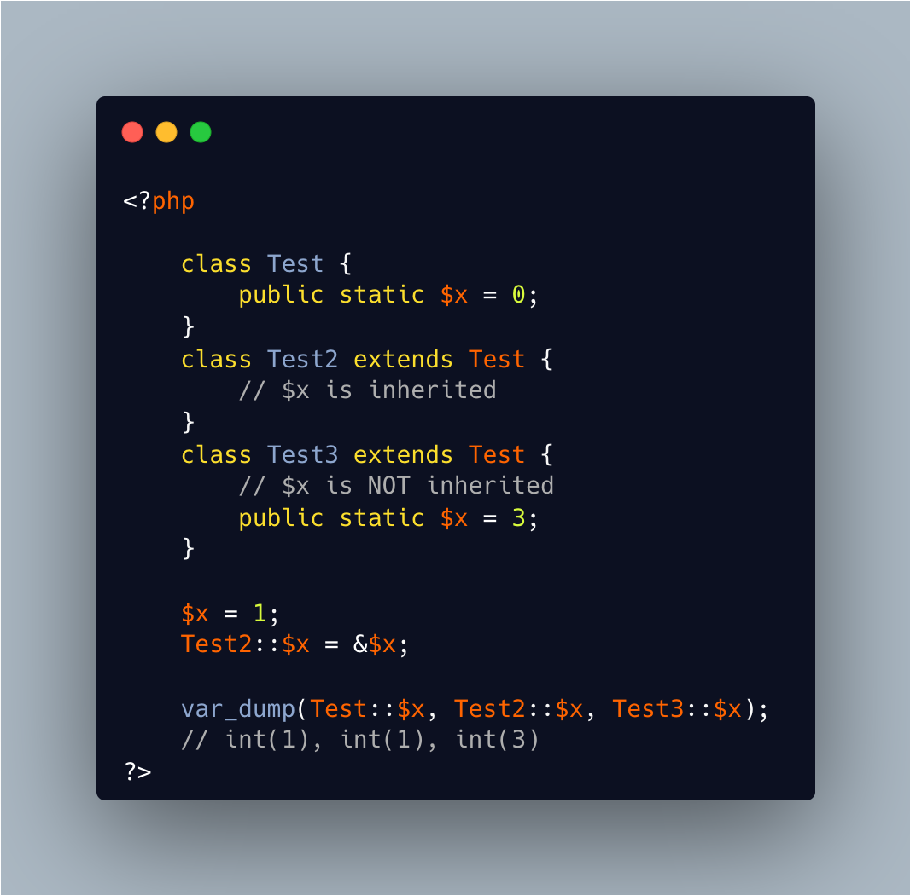

.. _static-properties:

Static Properties
-----------------

.. meta::
	:description:
		Static Properties: It is easy to read that the property ``$x`` is of type ``Test`` (via static), with an impossible default value of 0.
	:twitter:card: summary_large_image
	:twitter:site: @exakat
	:twitter:title: Static Properties
	:twitter:description: Static Properties: It is easy to read that the property ``$x`` is of type ``Test`` (via static), with an impossible default value of 0
	:twitter:creator: @exakat
	:twitter:image:src: https://php-tips.readthedocs.io/en/latest/_images/static_properties.png
	:og:image: https://php-tips.readthedocs.io/en/latest/_images/static_properties.png
	:og:title: Static Properties
	:og:type: article
	:og:description: It is easy to read that the property ``$x`` is of type ``Test`` (via static), with an impossible default value of 0
	:og:url: https://php-tips.readthedocs.io/en/latest/tips/static_properties.html
	:og:locale: en

.. raw:: html

	

It is easy to read that the property ``$x`` is of type ``Test`` (via static), with an impossible default value of 0. In fact, this property is not typed, as using ``static`` is not a possible type for properties.

Secondly, static properties are inherited and shared with the parent static properties, unless they are declared again. In that case, they are distinct.

See Also
________

* `Static keywords (PHP manual) <https://www.php.net/manual/en/language.oop5.static.php>`_
* `Static Properties on 3v4l <https://3v4l.org/78oEF>`_

