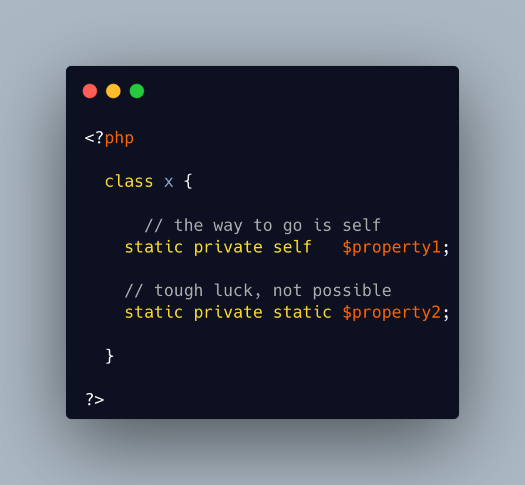

.. _cannot-static-static-property:

Cannot Static Static Property
-----------------------------

.. meta::
	:description:
		Cannot Static Static Property: Static can be used as a keyword to mark a property as ``static`` (sic).
	:twitter:card: summary_large_image
	:twitter:site: @exakat
	:twitter:title: Cannot Static Static Property
	:twitter:description: Cannot Static Static Property: Static can be used as a keyword to mark a property as ``static`` (sic)
	:twitter:creator: @exakat
	:twitter:image:src: https://php-tips.readthedocs.io/en/latest/_images/static_static_property.png
	:og:image: https://php-tips.readthedocs.io/en/latest/_images/static_static_property.png
	:og:title: Cannot Static Static Property
	:og:type: article
	:og:description: Static can be used as a keyword to mark a property as ``static`` (sic)
	:og:url: https://php-tips.readthedocs.io/en/latest/tips/static_static_property.html
	:og:locale: en

.. raw:: html

	

Static can be used as a keyword to mark a property as ``static`` (sic). It could also be used as a type for that same property, leading to those confusing lines below.

In fact, static would accept ``self``, but also ``parent`` and any children class: just like ``self``. So, ``self`` is sufficient to type properties, and there is no need for ``static static``.

See Also
________

* `Static properties (PHP manual) <https://www.php.net/manual/en/language.oop5.static.php#language.oop5.static.properties>`_
* `Late Static Binding (PHP manual) <https://www.php.net/manual/en/language.oop5.late-static-bindings.php#language.oop5.late-static-bindings>`_
* `5 usages of static keyword in PHP <https://www.exakat.io/en/5-usages-of-static-keyword-in-php/>`_
* `No static static <https://3v4l.org/C4DLP>`_ [Try me]

PHP Error Messages
__________________

* `Multiple static modifiers are not allowed <https://php-errors.readthedocs.io/en/latest/messages/multiple-static-modifiers-are-not-allowed.html>`_

