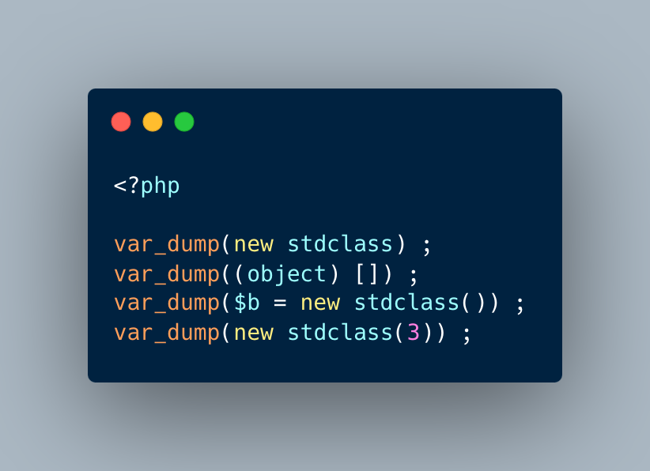

.. _stdclass-object:

stdClass Object
---------------

.. meta::
	:description:
		stdClass Object: PHP recycles the previously created stdClass objects ids.
	:twitter:card: summary_large_image
	:twitter:site: @exakat
	:twitter:title: stdClass Object
	:twitter:description: stdClass Object: PHP recycles the previously created stdClass objects ids
	:twitter:creator: @exakat
	:twitter:image:src: https://php-tips.readthedocs.io/en/latest/_images/stdclass_tracking.png.png
	:og:image: https://php-tips.readthedocs.io/en/latest/_images/stdclass_tracking.png
	:og:title: stdClass Object
	:og:type: article
	:og:description: PHP recycles the previously created stdClass objects ids
	:og:url: https://php-tips.readthedocs.io/en/latest/tips/stdclass_tracking.html
	:og:locale: en

PHP recycles the previously created stdClass objects ids. The following code displays Object #1, until it is stored in $b. When the stdClass is not stored in a container (variable, property, etc.), it is completely lost and no object counting happens.

Also, PHP's stdClass's constructor ignores all its arguments, as they are not used.

* `The stdClass class (PHP manual) <https://www.php.net/manual/en/class.stdclass.php>`_

