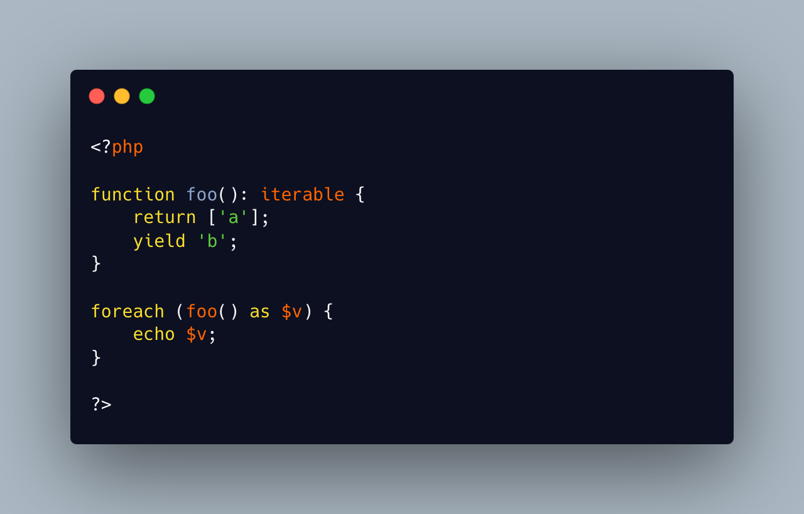

.. _stealth-generator:

Stealth Generator
-----------------

.. meta::
	:description:
		Stealth Generator: The code below has a useless loop.
	:twitter:card: summary_large_image
	:twitter:site: @exakat
	:twitter:title: Stealth Generator
	:twitter:description: Stealth Generator: The code below has a useless loop
	:twitter:creator: @exakat
	:twitter:image:src: https://php-tips.readthedocs.io/en/latest/_images/stealth-generator.png
	:og:image: https://php-tips.readthedocs.io/en/latest/_images/stealth-generator.png
	:og:title: Stealth Generator
	:og:type: article
	:og:description: The code below has a useless loop
	:og:url: https://php-tips.readthedocs.io/en/latest/tips/stealth-generator.html
	:og:locale: en

.. raw:: html

	

By `Frederic Bouchery <https://bsky.app/profile/bouchery.fr>`_

The code below has a useless loop. The presence of the ``yield`` keyword in the function body makes it a generator. As such, foreach() will react to ``yield`` calls, though the function returns immediately, without a ``yield``. Hence, the empty loop, even though the function returns an array: indeed, to have the function behave as expected, it is necessary to remove the unreachable ``yield`` call, and then, the foreach() can use the return for the loop.

See Also
________

* `Generator syntax <https://www.php.net/manual/en/language.generators.syntax.php>`_
* `stealth generator <https://3v4l.org/5d9JC>`_ [Try me]

PHP Features
____________

* `generator <https://php-dictionary.readthedocs.io/en/latest/dictionary/generator.ini.html>`_

* `yield <https://php-dictionary.readthedocs.io/en/latest/dictionary/yield.ini.html>`_

