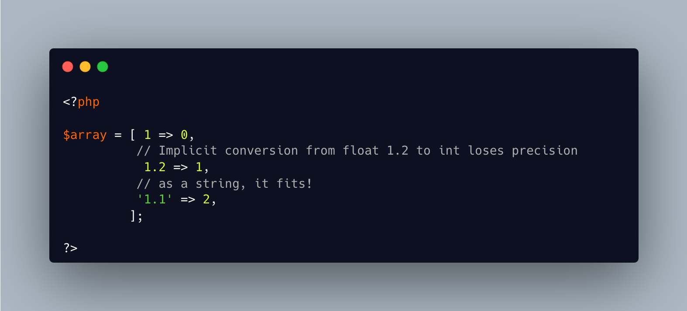

.. _store-float-as-index:

Store Float As Index
--------------------

.. meta::
	:description:
		Store Float As Index: With PHP, floats cannot be used directly as array indexes because array keys must be either integers or strings.
	:twitter:card: summary_large_image
	:twitter:site: @exakat
	:twitter:title: Store Float As Index
	:twitter:description: Store Float As Index: With PHP, floats cannot be used directly as array indexes because array keys must be either integers or strings
	:twitter:creator: @exakat
	:twitter:image:src: https://php-tips.readthedocs.io/en/latest/_images/store_float_as_index.png
	:og:image: https://php-tips.readthedocs.io/en/latest/_images/store_float_as_index.png
	:og:title: Store Float As Index
	:og:type: article
	:og:description: With PHP, floats cannot be used directly as array indexes because array keys must be either integers or strings
	:og:url: https://php-tips.readthedocs.io/en/latest/tips/store_float_as_index.html
	:og:locale: en

.. raw:: html

	

With PHP, floats cannot be used directly as array indexes because array keys must be either integers or strings. If you attempt to use a float as an index, PHP will automatically cast it to an integer, potentially causing unexpected behavior. However, you can explicitly cast the float to a string to preserve its precision as an index. Later, due to PHP's type juggling, you can still perform arithmetic with it seamlessly.

See Also
________

* `Storing float as keys <https://3v4l.org/dvHg8>`_ [Try me]

