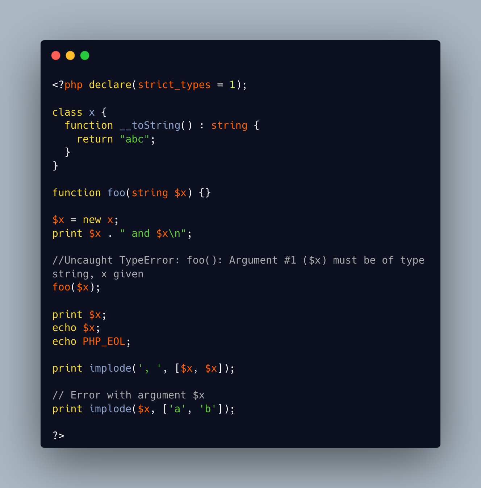

.. _strict_types-exceptions:

strict_types Exceptions
-----------------------

.. meta::
	:description:
		strict_types Exceptions: strict_types do not apply to PHP operators, only on to typed structures.
	:twitter:card: summary_large_image
	:twitter:site: @exakat
	:twitter:title: strict_types Exceptions
	:twitter:description: strict_types Exceptions: strict_types do not apply to PHP operators, only on to typed structures
	:twitter:creator: @exakat
	:twitter:image:src: https://php-tips.readthedocs.io/en/latest/_images/strict_types_exceptions.png
	:og:image: https://php-tips.readthedocs.io/en/latest/_images/strict_types_exceptions.png
	:og:title: strict_types Exceptions
	:og:type: article
	:og:description: strict_types do not apply to PHP operators, only on to typed structures
	:og:url: https://php-tips.readthedocs.io/en/latest/tips/strict_types_exceptions.html
	:og:locale: en

.. raw:: html

	

strict_types do not apply to PHP operators, only on to typed structures.

Here, concatenation and interpolation all call __toString(), but not foo().

As you can see, print() and echo() are safe too, while implode() is not: actually, it is not safe for the first argument, but still OK with the elements of the array, in the second argument.

See Also
________

* `live code <https://3v4l.org/R6XVR>`_
* `declare <https://www.php.net/manual/en/control-structures.declare.php>`_

