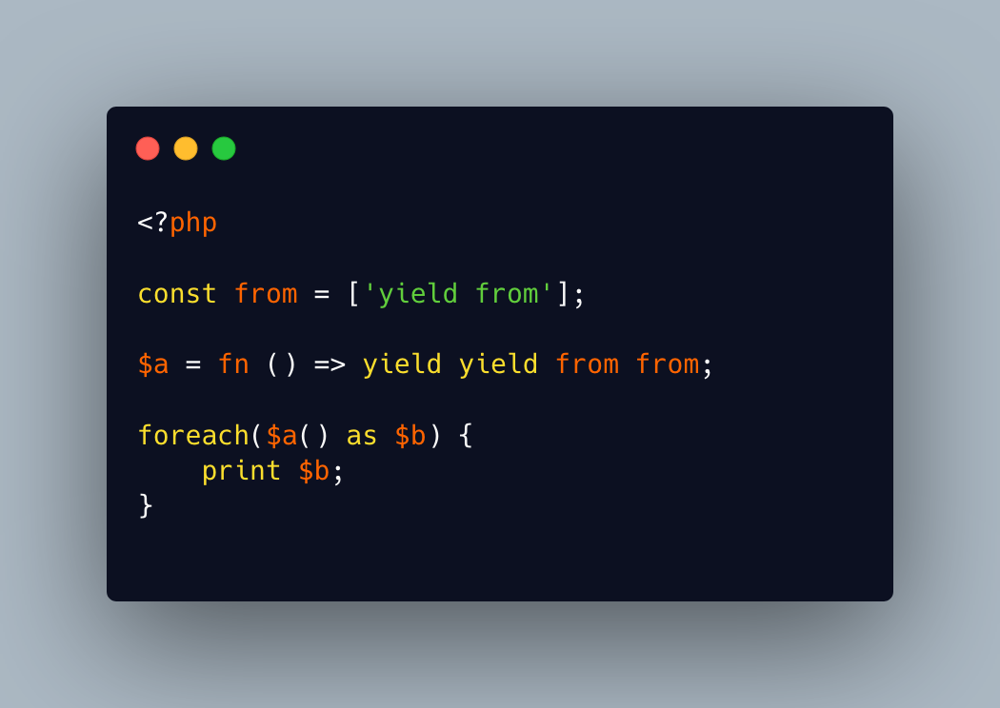

.. _stuttering-php:

Stuttering PHP
--------------

.. meta::
	:description:
		Stuttering PHP: Not a great joke, but it made me chuckle.
	:twitter:card: summary_large_image
	:twitter:site: @exakat
	:twitter:title: Stuttering PHP
	:twitter:description: Stuttering PHP: Not a great joke, but it made me chuckle
	:twitter:creator: @exakat
	:twitter:image:src: https://php-tips.readthedocs.io/en/latest/_images/stuttering.png
	:og:image: https://php-tips.readthedocs.io/en/latest/_images/stuttering.png
	:og:title: Stuttering PHP
	:og:type: article
	:og:description: Not a great joke, but it made me chuckle
	:og:url: https://php-tips.readthedocs.io/en/latest/tips/stuttering.html
	:og:locale: en

.. raw:: html

	

Not a great joke, but it made me chuckle.

Keep in mind that the first ``yield`` actually produces a ``null``, which is displayed as empty string, hence it is not visible.

May be, some PHP words may be forbidden, or, at least, avoided.

See Also
________

* `Stuttering PHP <https://3v4l.org/KiQGo>`_ [Try me]

PHP Features
____________

* `yield <https://php-dictionary.readthedocs.io/en/latest/dictionary/yield.ini.html>`_

* `yield-from <https://php-dictionary.readthedocs.io/en/latest/dictionary/yield-from.ini.html>`_

* `reserved-name <https://php-dictionary.readthedocs.io/en/latest/dictionary/reserved-name.ini.html>`_

