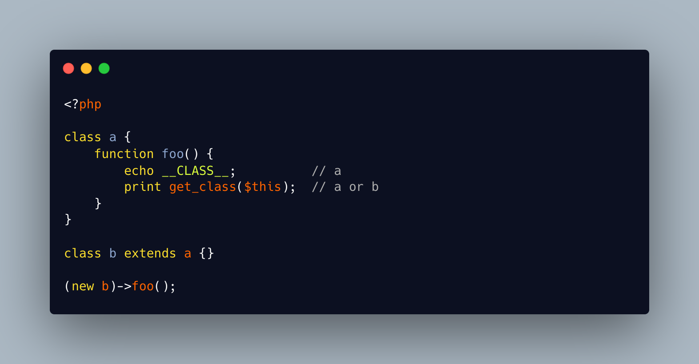

.. _$this-is-not-of-the-current-class:

$this Is Not Of The Current Class
---------------------------------

.. meta::
	:description:
		$this Is Not Of The Current Class: $this is a pseudo-variable, that represents the current object of the calling object (dixit the manual): it is often portrayed as representing an object of the current class.
	:twitter:card: summary_large_image
	:twitter:site: @exakat
	:twitter:title: $this Is Not Of The Current Class
	:twitter:description: $this Is Not Of The Current Class: $this is a pseudo-variable, that represents the current object of the calling object (dixit the manual): it is often portrayed as representing an object of the current class
	:twitter:creator: @exakat
	:twitter:image:src: https://php-tips.readthedocs.io/en/latest/_images/this_is_not_the_current_class.png
	:og:image: https://php-tips.readthedocs.io/en/latest/_images/this_is_not_the_current_class.png
	:og:title: $this Is Not Of The Current Class
	:og:type: article
	:og:description: $this is a pseudo-variable, that represents the current object of the calling object (dixit the manual): it is often portrayed as representing an object of the current class
	:og:url: https://php-tips.readthedocs.io/en/latest/tips/this_is_not_the_current_class.html
	:og:locale: en

.. raw:: html

	

$this is a pseudo-variable, that represents the current object of the calling object (dixit the manual): it is often portrayed as representing an object of the current class. This is commonly the case.

Yet, it is possible of this object to be an instance of another class. This happens with a child of the class, in particular when that child hasn't defined a method that is present in the parent. The fallback mechanism will use the parent class.

In the end, this is still compatible.

* `Class <https://www.php.net/manual/en/language.oop5.basic.php#language.oop5.basic.class>`_

