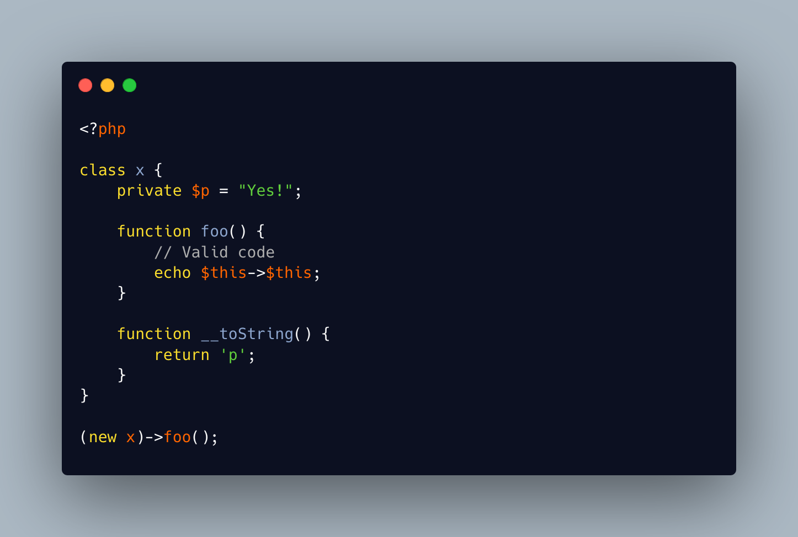

.. _$this-$this:

$this $this
-----------

.. meta::
	:description:
		$this $this: $this is the pseudo-variable that represents the current object.
	:twitter:card: summary_large_image
	:twitter:site: @exakat
	:twitter:title: $this $this
	:twitter:description: $this $this: $this is the pseudo-variable that represents the current object
	:twitter:creator: @exakat
	:twitter:image:src: https://php-tips.readthedocs.io/en/latest/_images/this_this.png
	:og:image: https://php-tips.readthedocs.io/en/latest/_images/this_this.png
	:og:title: $this $this
	:og:type: article
	:og:description: $this is the pseudo-variable that represents the current object
	:og:url: https://php-tips.readthedocs.io/en/latest/tips/this_this.html
	:og:locale: en

$this is the pseudo-variable that represents the current object. It is also a variable, like others, and may be used to describe a dynamic property.

Since a property must be described as a string, it is possible to use the magic method __toString() to convert the object into a string, and map an existing property.

* `$this (PHP manual) <https://www.php.net/manual/en/language.oop5.basic.php#language.oop5.basic.class>`_

