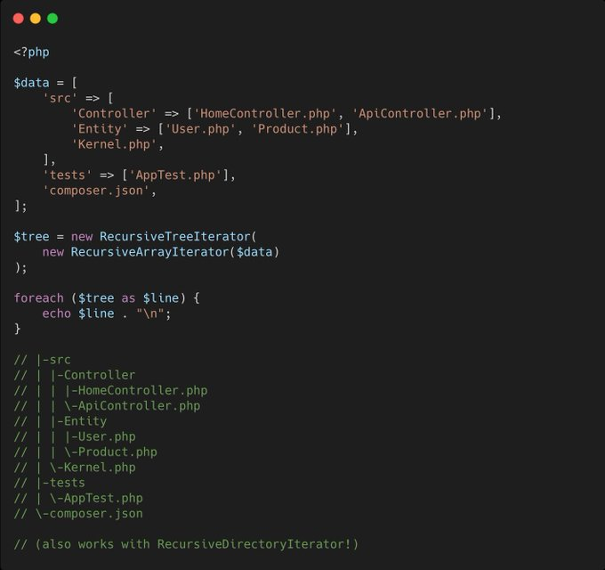

.. _dispaly-a-tree-natively:

Dispaly A Tree Natively
-----------------------

.. meta::
	:description:
		Dispaly A Tree Natively: PHP has a built-in ASCII tree renderer.
	:twitter:card: summary_large_image
	:twitter:site: @exakat
	:twitter:title: Dispaly A Tree Natively
	:twitter:description: Dispaly A Tree Natively: PHP has a built-in ASCII tree renderer
	:twitter:creator: @exakat
	:twitter:image:src: https://php-tips.readthedocs.io/en/latest/_images/tree-iterator.png
	:og:image: https://php-tips.readthedocs.io/en/latest/_images/tree-iterator.png
	:og:title: Dispaly A Tree Natively
	:og:type: article
	:og:description: PHP has a built-in ASCII tree renderer
	:og:url: https://php-tips.readthedocs.io/en/latest/tips/tree-iterator.html
	:og:locale: en

.. raw:: html

	

By `Alexandre Daubois <https://x.com/alexdaubois>`_

PHP has a built-in ASCII tree renderer. In the SPL.

RecursiveTreeIterator takes any recursive structure (arrays, directories, XML...) and outputs a formatted indented tree.

``tree`` command behavior. In PHP. Since 5.3.

Pretty sure I would have use it a few times if I knew it existed 😅.

See Also
________

* `RecursiveTreeIterator (PHP manual) <https://www.php.net/manual/en/class.recursivetreeiterator.php>`_
* `RecursiveIterator (PHP manual) <https://www.php.net/manual/en/class.recursiveiterator.php>`_
* `tree and iterator <https://3v4l.org/GS9dq>`_ [Try me]

PHP Features
____________

* `iterator <https://php-dictionary.readthedocs.io/en/latest/dictionary/iterator.ini.html>`_

* `tree <https://php-dictionary.readthedocs.io/en/latest/dictionary/tree.ini.html>`_

* `render <https://php-dictionary.readthedocs.io/en/latest/dictionary/render.ini.html>`_

