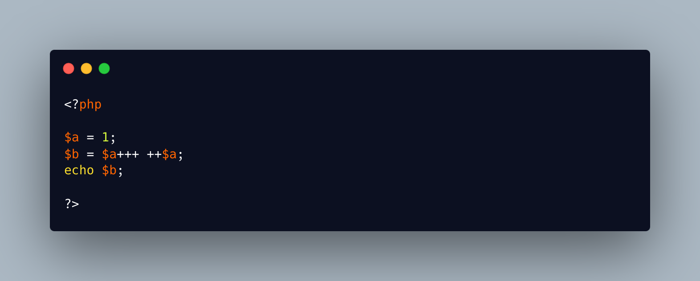

.. _triple-plus-operator:

Triple Plus Operator
--------------------

.. meta::
	:description:
		Triple Plus Operator: This is a white space trick, where the expression allows for ``++`` and ``+`` to follow each other.
	:twitter:card: summary_large_image
	:twitter:site: @exakat
	:twitter:title: Triple Plus Operator
	:twitter:description: Triple Plus Operator: This is a white space trick, where the expression allows for ``++`` and ``+`` to follow each other
	:twitter:creator: @exakat
	:twitter:image:src: https://php-tips.readthedocs.io/en/latest/_images/triple_plus_operator.png
	:og:image: https://php-tips.readthedocs.io/en/latest/_images/triple_plus_operator.png
	:og:title: Triple Plus Operator
	:og:type: article
	:og:description: This is a white space trick, where the expression allows for ``++`` and ``+`` to follow each other
	:og:url: https://php-tips.readthedocs.io/en/latest/tips/triple_plus_operator.html
	:og:locale: en

.. raw:: html

	

This is a white space trick, where the expression allows for ``++`` and ``+`` to follow each other. Note that it is not possible to make a quadruple (four times) or pentuple (five times), operator, as PHP does not parse it anymore.

See Also
________

* `Incrementing/Decrementing Operators <https://www.php.net/manual/en/language.operators.increment.php>`_
* `Operators <https://www.php.net/manual/en/language.operators.php>`_
* `Triple plus operator in action <https://3v4l.org/Kku5h>`_ [Try me]

