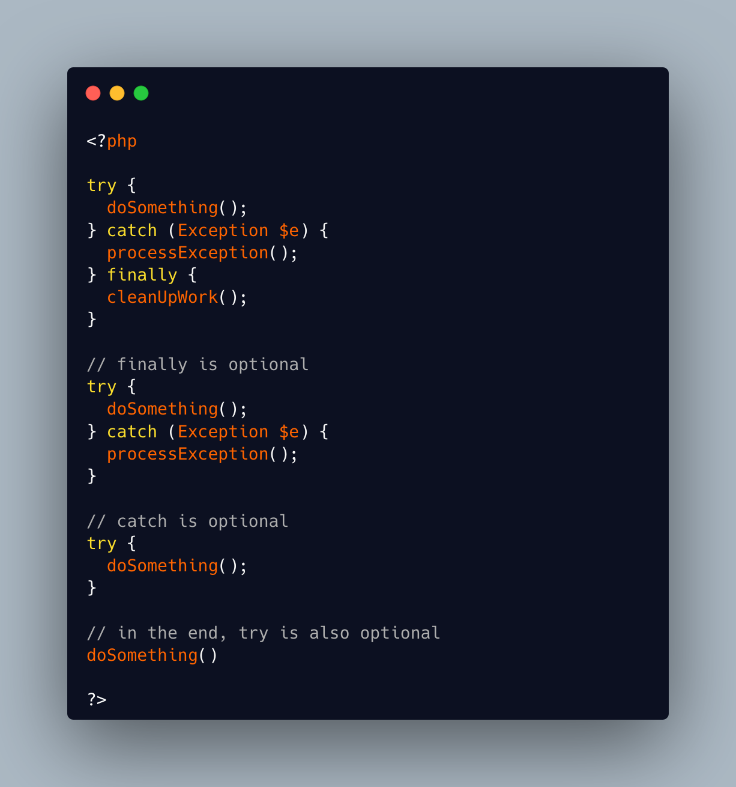

.. _try,-catch,-finally-are-all-optional:

try, catch, finally Are All Optional
------------------------------------

.. meta::
	:description:
		try, catch, finally Are All Optional: The finally clause in a try-catch-finally is actually optional: it can be omitted.
	:twitter:card: summary_large_image
	:twitter:site: @exakat
	:twitter:title: try, catch, finally Are All Optional
	:twitter:description: try, catch, finally Are All Optional: The finally clause in a try-catch-finally is actually optional: it can be omitted
	:twitter:creator: @exakat
	:twitter:image:src: https://php-tips.readthedocs.io/en/latest/_images/try-catch-finally.png
	:og:image: https://php-tips.readthedocs.io/en/latest/_images/try-catch-finally.png
	:og:title: try, catch, finally Are All Optional
	:og:type: article
	:og:description: The finally clause in a try-catch-finally is actually optional: it can be omitted
	:og:url: https://php-tips.readthedocs.io/en/latest/tips/try-catch-finally.html
	:og:locale: en

.. raw:: html

	

The finally clause in a try-catch-finally is actually optional: it can be omitted.

The catch clauses in a try-catch-finally are also optional: they can be omitted.

When the catch and finally clauses are all omitted, the try clause can also be omitted safely.

See Also
________

* `Exceptions (PHP manual) <https://www.php.net/manual/en/language.exceptions.php>`_
* ` <>`_

