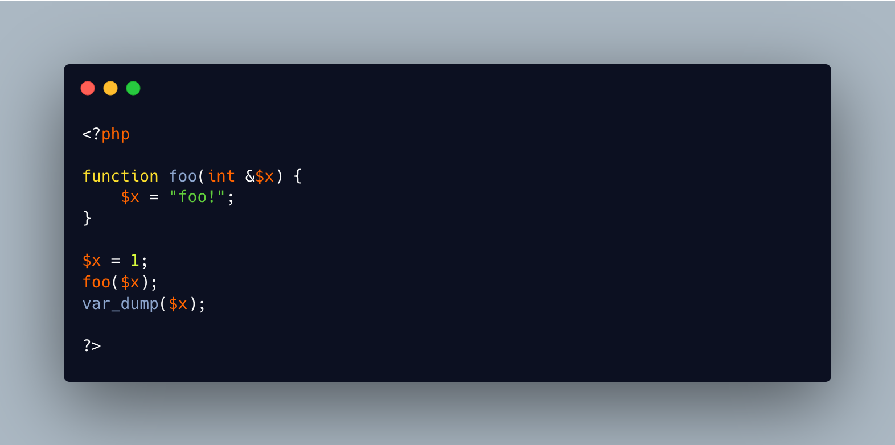

.. _type-and-reference:

Type And Reference
------------------

.. meta::
	:description:
		Type And Reference: Parameter's type is check at calling time.
	:twitter:card: summary_large_image
	:twitter:site: @exakat
	:twitter:title: Type And Reference
	:twitter:description: Type And Reference: Parameter's type is check at calling time
	:twitter:creator: @exakat
	:twitter:image:src: https://php-tips.readthedocs.io/en/latest/_images/type_and_reference.png
	:og:image: https://php-tips.readthedocs.io/en/latest/_images/type_and_reference.png
	:og:title: Type And Reference
	:og:type: article
	:og:description: Parameter's type is check at calling time
	:og:url: https://php-tips.readthedocs.io/en/latest/tips/type_and_reference.html
	:og:locale: en

.. raw:: html

	

Parameter's type is check at calling time. Later, the type of the argument is not enforced anymore, and the argument behaves like a local variable: its type may change.

When typing a parameter and passing it by reference, the type is checked at call time, and then, never checked again. This means the variable may change its type, and, by consequence, the original value may also end up with a different type than expected.

If you want persistent typing, use a property: its type is checked at every step of its life.

See Also
________

* `Function parameters and arguments (PHP manual) <https://www.php.net/manual/en/functions.arguments.php>`_
* `References are poison <https://phpc.social/@k47@k47.cz/114556570140219356>`_
* `int became string <https://3v4l.org/79cJH>`_ [Try me]

PHP Features
____________

* `reference <https://php-dictionary.readthedocs.io/en/latest/dictionary/reference.ini.html>`_

* `argument <https://php-dictionary.readthedocs.io/en/latest/dictionary/argument.ini.html>`_

