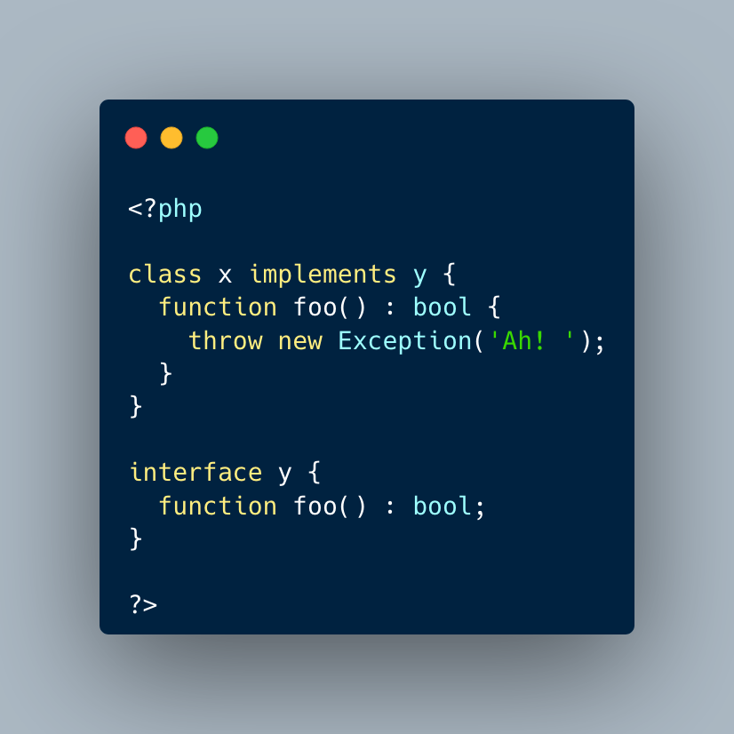

.. _type-is-not-always-returned:

Type Is Not Always Returned
---------------------------

.. meta::
	:description:
		Type Is Not Always Returned: A method can display a return type, and never return it actually.
	:twitter:card: summary_large_image
	:twitter:site: @exakat
	:twitter:title: Type Is Not Always Returned
	:twitter:description: Type Is Not Always Returned: A method can display a return type, and never return it actually
	:twitter:creator: @exakat
	:twitter:image:src: https://php-tips.readthedocs.io/en/latest/_images/type_is_not_available.png
	:og:image: https://php-tips.readthedocs.io/en/latest/_images/type_is_not_available.png
	:og:title: Type Is Not Always Returned
	:og:type: article
	:og:description: A method can display a return type, and never return it actually
	:og:url: https://php-tips.readthedocs.io/en/latest/tips/type_is_not_available.html
	:og:locale: en

.. raw:: html

	

A method can display a return type, and never return it actually. This happens with exceptions, errors, yield and infinite loops. May be 'never' would be a better choice, if possible.

On the other hand, a function returning 'void', aka returning nothing, should not have any return statement, including the hidden one at the end of the method.

See Also
________

* `Type Declaration (PHP manual) <https://www.php.net/manual/en/language.types.declarations.php>`_

