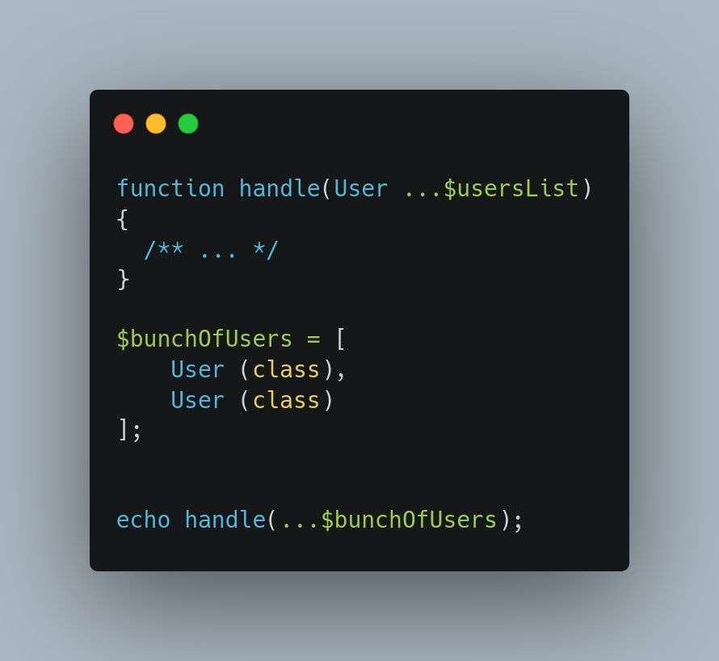

.. _typed-array:

Typed Array
-----------

.. meta::
	:description:
		Typed Array: It is possible to set the type of all elements in a variadic: this is equivalent of passing an argument of type ``array<User>``.
	:twitter:card: summary_large_image
	:twitter:site: @exakat
	:twitter:title: Typed Array
	:twitter:description: Typed Array: It is possible to set the type of all elements in a variadic: this is equivalent of passing an argument of type ``array<User>``
	:twitter:creator: @exakat
	:twitter:image:src: https://php-tips.readthedocs.io/en/latest/_images/typed_array.png
	:og:image: https://php-tips.readthedocs.io/en/latest/_images/typed_array.png
	:og:title: Typed Array
	:og:type: article
	:og:description: It is possible to set the type of all elements in a variadic: this is equivalent of passing an argument of type ``array<User>``
	:og:url: https://php-tips.readthedocs.io/en/latest/tips/typed_array.html
	:og:locale: en

.. raw:: html

	

By `• Kartoffeljunge • <https://bsky.app/profile/devatreides.bsky.social>`_

It is possible to set the type of all elements in a variadic: this is equivalent of passing an argument of type ``array<User>``. That way, all the elements in the array must have the expected type. Use union-type to make have several distinct types.

See Also
________

* `Original on BluSky <https://bsky.app/profile/devatreides.bsky.social/post/3l3bwchdism2s>`_
* `Typing a whole array <https://3v4l.org/Ov9mJ>`_

