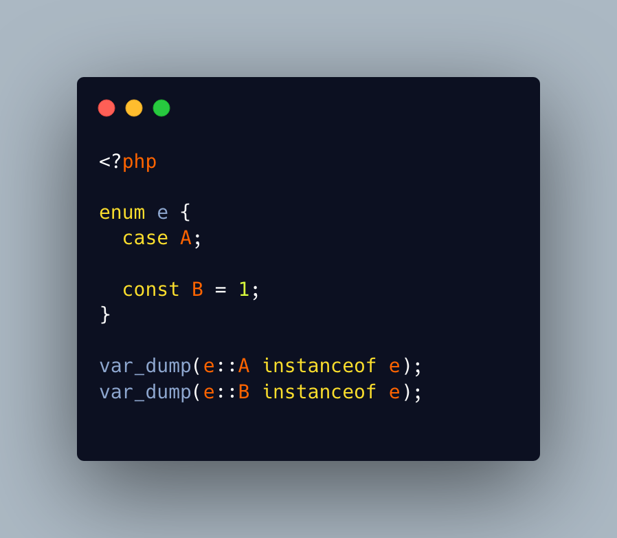

.. _typed-by-enum:

Typed By Enum
-------------

.. meta::
	:description:
		Typed By Enum: Enumeration cannot be instantiated into an object.
	:twitter:card: summary_large_image
	:twitter:site: @exakat
	:twitter:title: Typed By Enum
	:twitter:description: Typed By Enum: Enumeration cannot be instantiated into an object
	:twitter:creator: @exakat
	:twitter:image:src: https://php-tips.readthedocs.io/en/latest/_images/typed_by_enum.png
	:og:image: https://php-tips.readthedocs.io/en/latest/_images/typed_by_enum.png
	:og:title: Typed By Enum
	:og:type: article
	:og:description: Enumeration cannot be instantiated into an object
	:og:url: https://php-tips.readthedocs.io/en/latest/tips/typed_by_enum.html
	:og:locale: en

.. raw:: html

	

Enumeration cannot be instantiated into an object. In fact, the cases of the enumeration are the objects. Hence, a case object has the enumeration type.

Then, an enumeration (class) constant cannot be confused with a case, because the enumeration cannot be instantiated, and class constants also do not support new initializers.

See Also
________

* `Enumeration (PHP manual) <https://www.php.net/manual/en/language.types.enumerations.php>`_
* `Typing with enum <https://3v4l.org/9LZpq>`_ [Try me]

PHP Features
____________

* `enum <https://php-dictionary.readthedocs.io/en/latest/dictionary/enum.ini.html>`_

* `type <https://php-dictionary.readthedocs.io/en/latest/dictionary/type.ini.html>`_

