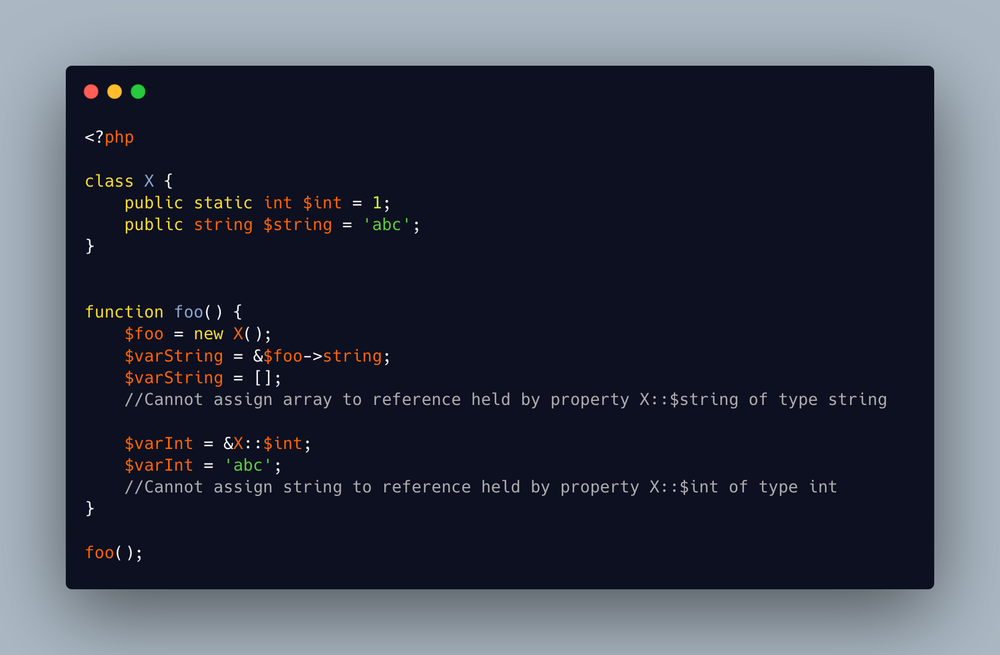

.. _typed-variables:

Typed Variables
---------------

.. meta::
	:description:
		Typed Variables: A local variable cannot be typed.
	:twitter:card: summary_large_image
	:twitter:site: @exakat
	:twitter:title: Typed Variables
	:twitter:description: Typed Variables: A local variable cannot be typed
	:twitter:creator: @exakat
	:twitter:image:src: https://php-tips.readthedocs.io/en/latest/_images/typed_variables.png
	:og:image: https://php-tips.readthedocs.io/en/latest/_images/typed_variables.png
	:og:title: Typed Variables
	:og:type: article
	:og:description: A local variable cannot be typed
	:og:url: https://php-tips.readthedocs.io/en/latest/tips/typed_variables.html
	:og:locale: en

.. raw:: html

	

A local variable cannot be typed.

I mean, it may be typed at argument or return time, but not permanantly, like a property.

To create a typed variable, one may use a reference to a property. The property may be typed, and this constraint is extended to the variable, with a dedicated message.

It works on static and normal properties. And it looks a bit cumbersome to use.

See Also
________

* `Typed Variables <https://3v4l.org/H1uAS>`_ [Try me]

PHP Error Messages
__________________

* `Cannot assign %s to reference held by property %s::$%s of type %s <https://php-errors.readthedocs.io/en/latest/messages/cannot-assign-%25s-to-reference-held-by-property-%25s%3A%3A%24%25s-of-type-%25s.html>`_

PHP Features
____________

* `type <https://php-dictionary.readthedocs.io/en/latest/dictionary/type.ini.html>`_

* `variable <https://php-dictionary.readthedocs.io/en/latest/dictionary/variable.ini.html>`_

