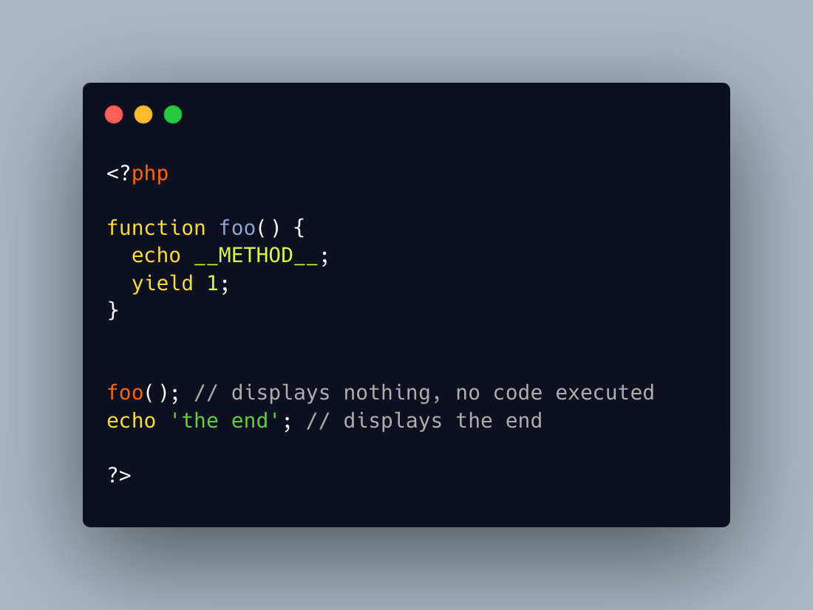

.. _uncallable-function:

Uncallable Function
-------------------

.. meta::
	:description:
		Uncallable Function: The function foo() cannot be called.
	:twitter:card: summary_large_image
	:twitter:site: @exakat
	:twitter:title: Uncallable Function
	:twitter:description: Uncallable Function: The function foo() cannot be called
	:twitter:creator: @exakat
	:twitter:image:src: https://php-tips.readthedocs.io/en/latest/_images/uncallable_function.png
	:og:image: https://php-tips.readthedocs.io/en/latest/_images/uncallable_function.png
	:og:title: Uncallable Function
	:og:type: article
	:og:description: The function foo() cannot be called
	:og:url: https://php-tips.readthedocs.io/en/latest/tips/uncallable_function.html
	:og:locale: en

The function foo() cannot be called. When the code does so, nothing happens.

The trick is the inclusion of a call to yield (or yield from) in the function. It turns the function into a generator, and calling it directly does nothing. It needs to be called with foreach() or iterator_to_array().

This trick applies to functions, arrow functions, closures and methods.

* `Generators (PHP manual) <https://www.php.net/manual/en/language.generators.overview.php>`_
* `Code on 3v4l.org <https://3v4l.org/PvCYO>`_

