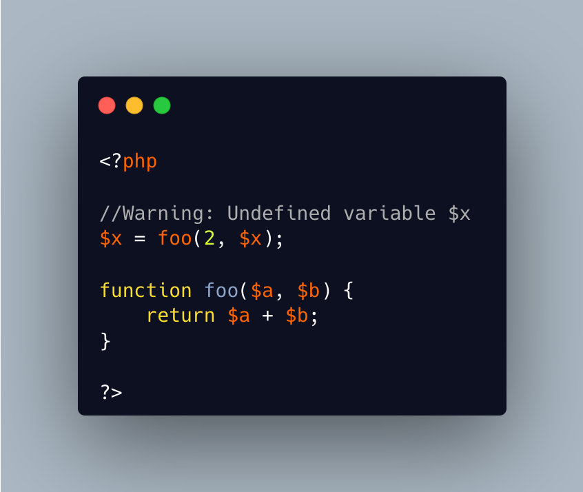

.. _undefined-variable:

Undefined Variable
------------------

.. meta::
	:description:
		Undefined Variable: The variable is undefined, and yet this is reported on the actual line where the variable is defined!.
	:twitter:card: summary_large_image
	:twitter:site: @exakat
	:twitter:title: Undefined Variable
	:twitter:description: Undefined Variable: The variable is undefined, and yet this is reported on the actual line where the variable is defined!
	:twitter:creator: @exakat
	:twitter:image:src: https://php-tips.readthedocs.io/en/latest/_images/undefined_variable.png
	:og:image: https://php-tips.readthedocs.io/en/latest/_images/undefined_variable.png
	:og:title: Undefined Variable
	:og:type: article
	:og:description: The variable is undefined, and yet this is reported on the actual line where the variable is defined!
	:og:url: https://php-tips.readthedocs.io/en/latest/tips/undefined_variable.html
	:og:locale: en

The variable is undefined, and yet this is reported on the actual line where the variable is defined!

In fact, the assignation to ``$x`` appears to be the definition of the variable, because we, as human, encounter it first while reading.

Upon close inspection, the variable is actually used in the call to the function ``foo``: PHP evaluates the arguments before calling the function, and finally, make the assignation. So the ``$x``, used as second parameter in the ``foo`` call, is actually the first usage of the variable ``$x``. Hence, the error message.

