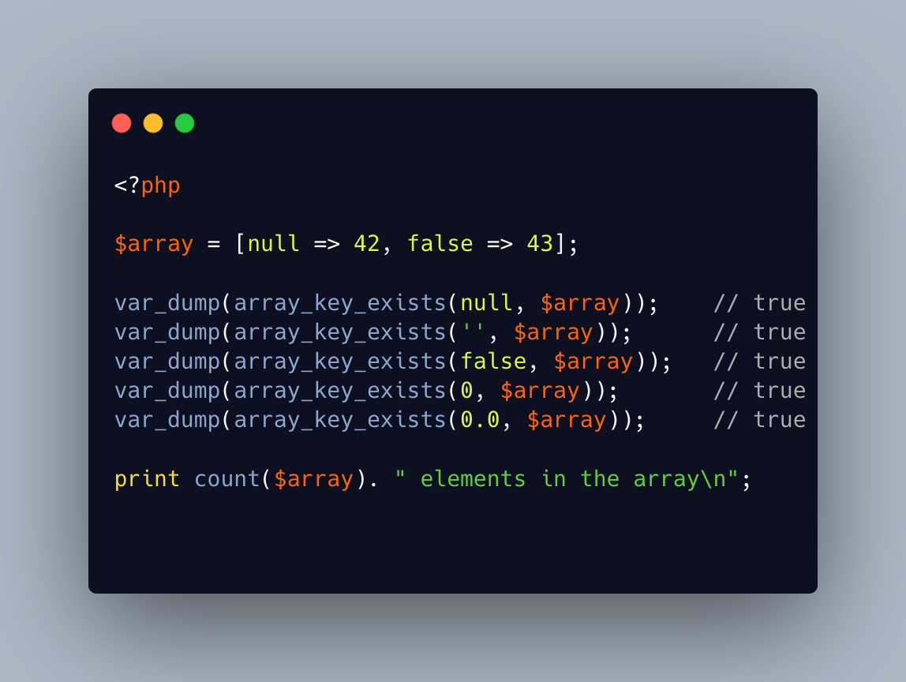

.. _unexpected-keys-in-array:

Unexpected keys in array
------------------------

It is possible to put 2 elements in a PHP array, find different 5 keys with array_key_exists or isset) and yet, still count 2 distinct elements (key wise).

The type-juggling for array keys is applied in every PHP features, to keep things easy to use.

This code is one rare way to show how it still leaks. Depending on the context, it might be very confusing.

* `Arrays (PHP manual) <https://www.php.net/manual/en/language.types.array.php>`_

