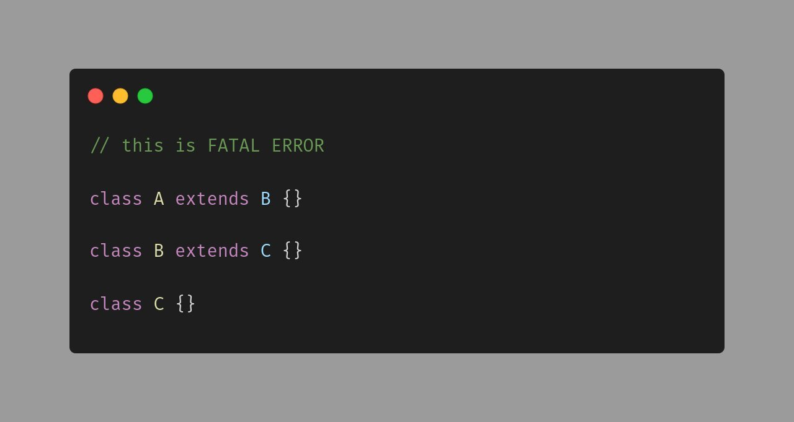

.. _unfinished-class-doesn't-compile:

Unfinished Class Doesn't Compile
--------------------------------

	.. meta::
		:description lang=en:
			Unfinished Class Doesn't Compile: PHP is not able to use a class before it is defined.

By `Jan Nedbal <https://janedbal.cz/>`_

PHP is not able to use a class before it is defined. Yet, when the second class is simple enough to be entirely defined, it would. When the class is not completely defined, aka it has the extends, implements, or use (for trait) keywords, PHP postpone the finalization of the class to execution phase, and consider it as non-defined.

* `Object Inheritance <https://www.php.net/manual/en/language.oop5.inheritance.php>`_
* `Sometimes, PHP world is really weird. <https://twitter.com/janedbal/status/1758410205568643495>`_

