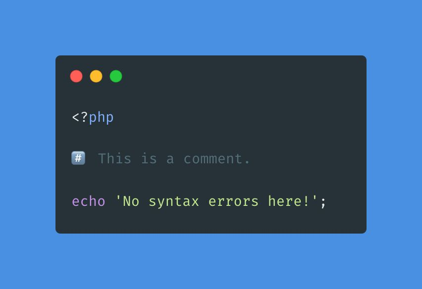

.. _unicode-comments:

Unicode Comments
----------------

.. meta::
	:description:
		Unicode Comments: Besides ``//``, ``#``, ``/** */`` and ``/* */``, there is another way to make a comment in PHP: unicode #️⃣️ .
	:twitter:card: summary_large_image
	:twitter:site: @exakat
	:twitter:title: Unicode Comments
	:twitter:description: Unicode Comments: Besides ``//``, ``#``, ``/** */`` and ``/* */``, there is another way to make a comment in PHP: unicode #️⃣️ 
	:twitter:creator: @exakat
	:twitter:image:src: https://php-tips.readthedocs.io/en/latest/_images/unicode_comments.png
	:og:image: https://php-tips.readthedocs.io/en/latest/_images/unicode_comments.png
	:og:title: Unicode Comments
	:og:type: article
	:og:description: Besides ``//``, ``#``, ``/** */`` and ``/* */``, there is another way to make a comment in PHP: unicode #️⃣️ 
	:og:url: https://php-tips.readthedocs.io/en/latest/tips/unicode_comments.html
	:og:locale: en

.. raw:: html

	

By `Aken Roberts <https://bsky.app/profile/akenroberts.com>`_

Besides ``//``, ``#``, ``/** */`` and ``/* */``, there is another way to make a comment in PHP: unicode #️⃣️ . This is possible as this unicode character is build on top of 3 codepoints: among those, the first one is ``#``, which is an actual comment character. Then, PHP parses it as a single bytes, and interprets it as a comment: the rest of the line is omitted.

* `Comments (PHP manual) <https://www.php.net/manual/en/language.basic-syntax.comments.php>`_

