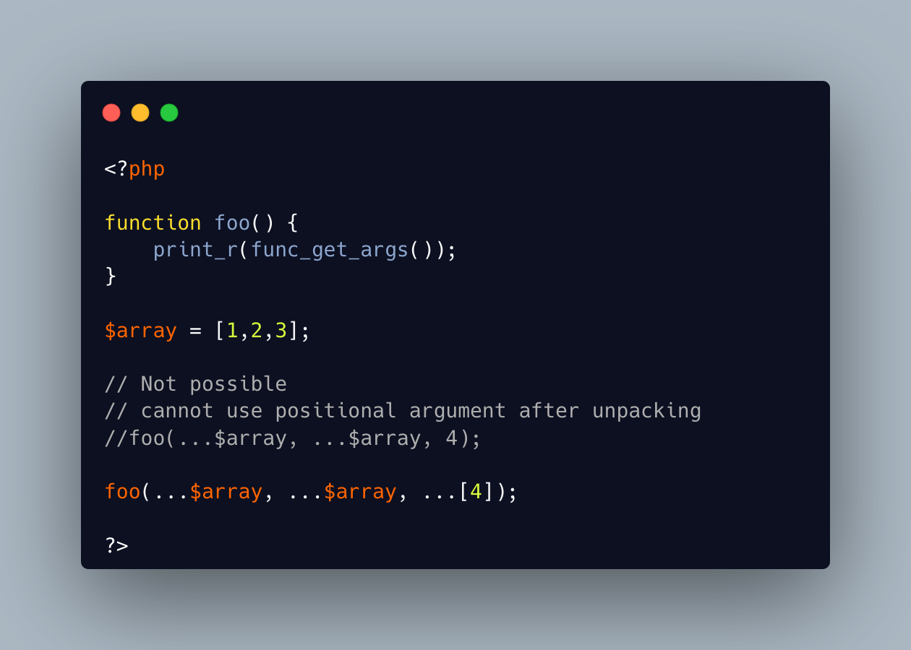

.. _unpacking-a-single-element-array:

Unpacking A Single Element Array
--------------------------------

.. meta::
	:description:
		Unpacking A Single Element Array: The ellipsis operator ``.
	:twitter:card: summary_large_image
	:twitter:site: @exakat
	:twitter:title: Unpacking A Single Element Array
	:twitter:description: Unpacking A Single Element Array: The ellipsis operator ``
	:twitter:creator: @exakat
	:twitter:image:src: https://php-tips.readthedocs.io/en/latest/_images/unpacking_single_array.png
	:og:image: https://php-tips.readthedocs.io/en/latest/_images/unpacking_single_array.png
	:og:title: Unpacking A Single Element Array
	:og:type: article
	:og:description: The ellipsis operator ``
	:og:url: https://php-tips.readthedocs.io/en/latest/tips/unpacking_single_array.html
	:og:locale: en

.. raw:: html

	

The ellipsis operator ``...`` is used to unpack arrays as individual arguments in a method call. Its opposite is the ``[]`` array, which holds a random number of values.

Using both together is useless, as ellipsis neutralize the array.

Yet, when unpacking several arrays as arguments, it is not possible to use literal values after the unpacked arguments.

The solution is to put these arguments in another literal array, and unpack them, as the previous ones.

See Also
________

* `Unpacking single element arrays <https://3v4l.org/n1pq9>`_ [Try me]

PHP Error Messages
__________________

* `Cannot use positional argument after argument unpacking <https://php-errors.readthedocs.io/en/latest/messages/cannot-use-positional-argument-after-argument-unpacking.html>`_

PHP Features
____________

* `ellipsis <https://php-dictionary.readthedocs.io/en/latest/dictionary/ellipsis.ini.html>`_

* `unpacking <https://php-dictionary.readthedocs.io/en/latest/dictionary/unpacking.ini.html>`_

