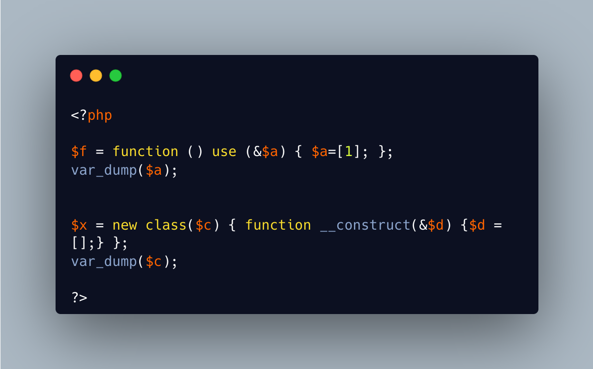

.. _variable-creation:

Variable Creation
-----------------

.. meta::
	:description:
		Variable Creation: When defining a closure, the lexical variables (in the ``use`` clause) are created immediately, with the default value of NULL.
	:twitter:card: summary_large_image
	:twitter:site: @exakat
	:twitter:title: Variable Creation
	:twitter:description: Variable Creation: When defining a closure, the lexical variables (in the ``use`` clause) are created immediately, with the default value of NULL
	:twitter:creator: @exakat
	:twitter:image:src: https://php-tips.readthedocs.io/en/latest/_images/variable_creation.png
	:og:image: https://php-tips.readthedocs.io/en/latest/_images/variable_creation.png
	:og:title: Variable Creation
	:og:type: article
	:og:description: When defining a closure, the lexical variables (in the ``use`` clause) are created immediately, with the default value of NULL
	:og:url: https://php-tips.readthedocs.io/en/latest/tips/variable_creation.html
	:og:locale: en

.. raw:: html

	

When defining a closure, the lexical variables (in the ``use`` clause) are created immediately, with the default value of NULL. The closure is executed later, and then, the value of the lexical variable is changed.

When creating an anonymous object, the constructor is immediately executed: hence, the argument with reference is created, then inited with ``[]`` and immediately available.

See Also
________

* `The Closure class <https://www.php.net/manual/en/class.closure.php>`_
* `Anonymous functions <https://www.php.net/manual/en/functions.anonymous.php>`_
* `Create variables with a closure <https://3v4l.org/Z5jgo>`_ [Try me]

PHP Features
____________

* `variable <https://php-dictionary.readthedocs.io/en/latest/dictionary/variable.ini.html>`_

* `closure <https://php-dictionary.readthedocs.io/en/latest/dictionary/closure.ini.html>`_

