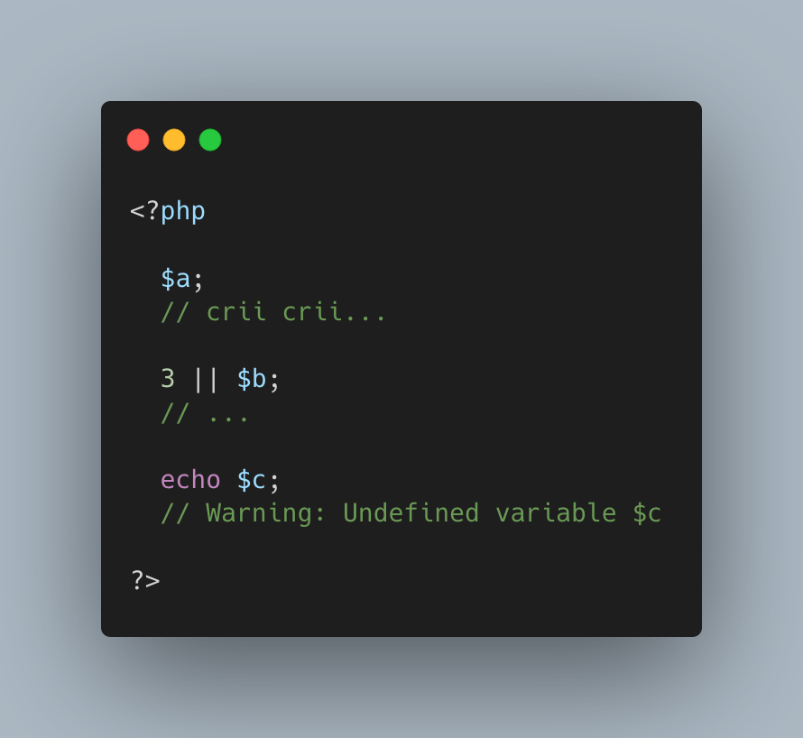

.. _no-warning-for-unused-variables:

No Warning For Unused Variables
-------------------------------

.. meta::
	:description:
		No Warning For Unused Variables: PHP optimisation in action : undefined variables are only reported when they are used.
	:twitter:card: summary_large_image
	:twitter:site: @exakat
	:twitter:title: No Warning For Unused Variables
	:twitter:description: No Warning For Unused Variables: PHP optimisation in action : undefined variables are only reported when they are used
	:twitter:creator: @exakat
	:twitter:image:src: https://php-tips.readthedocs.io/en/latest/_images/variable_optimisation.png
	:og:image: https://php-tips.readthedocs.io/en/latest/_images/variable_optimisation.png
	:og:title: No Warning For Unused Variables
	:og:type: article
	:og:description: PHP optimisation in action : undefined variables are only reported when they are used
	:og:url: https://php-tips.readthedocs.io/en/latest/tips/variable_optimisation.html
	:og:locale: en

PHP optimisation in action : undefined variables are only reported when they are used.

first is omitted : no operation

second is skipped : no need to execute 2nd term

third is reporting a warning.

* `Variables (PHP manual) <https://www.php.net/manual/en/language.variables.php>`_

