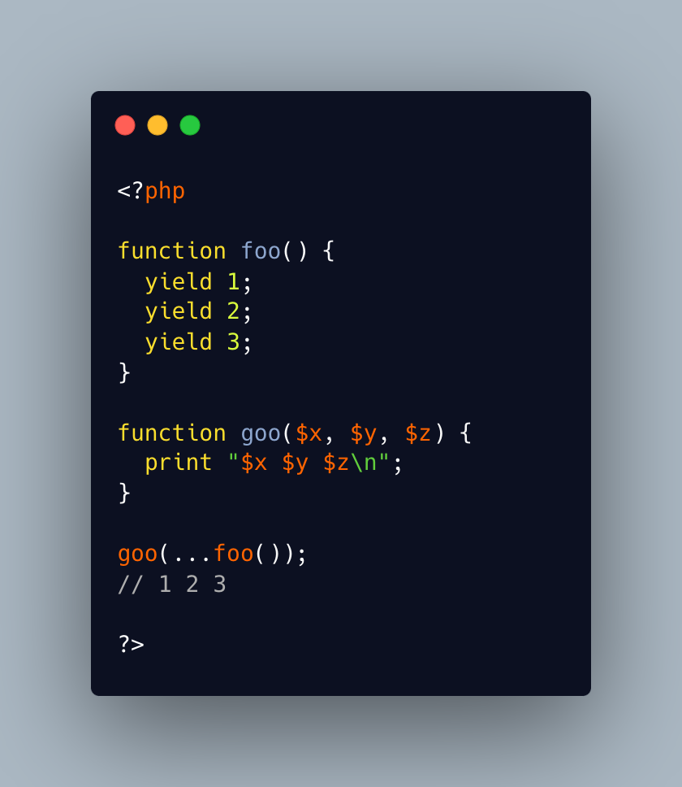

.. _variadic-all-the-yields:

Variadic All The Yields
-----------------------

.. meta::
	:description:
		Variadic All The Yields: The ellipsis operator works on generators: it is akin to a foreach() on all the values, or a call to iterator_to_array().
	:twitter:card: summary_large_image
	:twitter:site: @exakat
	:twitter:title: Variadic All The Yields
	:twitter:description: Variadic All The Yields: The ellipsis operator works on generators: it is akin to a foreach() on all the values, or a call to iterator_to_array()
	:twitter:creator: @exakat
	:twitter:image:src: https://php-tips.readthedocs.io/en/latest/_images/variadic_all_yield.png
	:og:image: https://php-tips.readthedocs.io/en/latest/_images/variadic_all_yield.png
	:og:title: Variadic All The Yields
	:og:type: article
	:og:description: The ellipsis operator works on generators: it is akin to a foreach() on all the values, or a call to iterator_to_array()
	:og:url: https://php-tips.readthedocs.io/en/latest/tips/variadic_all_yield.html
	:og:locale: en

.. raw:: html

	

The ellipsis operator works on generators: it is akin to a foreach() on all the values, or a call to iterator_to_array().

Here, the generator produces three values, and they are used to fill the three argument positions. It makes a kind of shortcut.

See Also
________

* `Variable-length argument lists (PHP manual) <https://www.php.net/manual/en/functions.arguments.php#functions.variable-arg-list>`_
* `Generator (PHP manual) <https://www.php.net/manual/en/language.generators.overview.php>`_
* `Generator In Function Call <https://3v4l.org/WdGDd>`_ [Try me]

PHP Features
____________

* `ellipsis <https://php-dictionary.readthedocs.io/en/latest/dictionary/ellipsis.ini.html>`_

* `generator <https://php-dictionary.readthedocs.io/en/latest/dictionary/generator.ini.html>`_

* `argument <https://php-dictionary.readthedocs.io/en/latest/dictionary/argument.ini.html>`_

