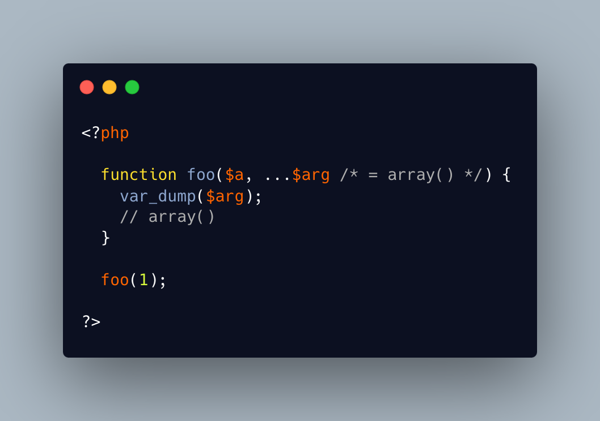

.. _variadic-are-typed-and-defaulted:

Variadic Are Typed And Defaulted
--------------------------------

.. meta::
	:description:
		Variadic Are Typed And Defaulted: When using the ``.
	:twitter:card: summary_large_image
	:twitter:site: @exakat
	:twitter:title: Variadic Are Typed And Defaulted
	:twitter:description: Variadic Are Typed And Defaulted: When using the ``
	:twitter:creator: @exakat
	:twitter:image:src: https://php-tips.readthedocs.io/en/latest/_images/variadic_are_typed_and_defaulted.png
	:og:image: https://php-tips.readthedocs.io/en/latest/_images/variadic_are_typed_and_defaulted.png
	:og:title: Variadic Are Typed And Defaulted
	:og:type: article
	:og:description: When using the ``
	:og:url: https://php-tips.readthedocs.io/en/latest/tips/variadic_are_typed_and_defaulted.html
	:og:locale: en

.. raw:: html

	

When using the ``...`` operator, the argument is automatically typed and defaulted: it is typed with array, and its default value is the empty array ``[]``.

There can be a type added to the argument, and, with it, element element of the argument will be of this type. Yet, the argument itself is actually ``array``.

* `Type declarations (PHP manual) <https://www.php.net/manual/en/language.types.declarations.php>`_

