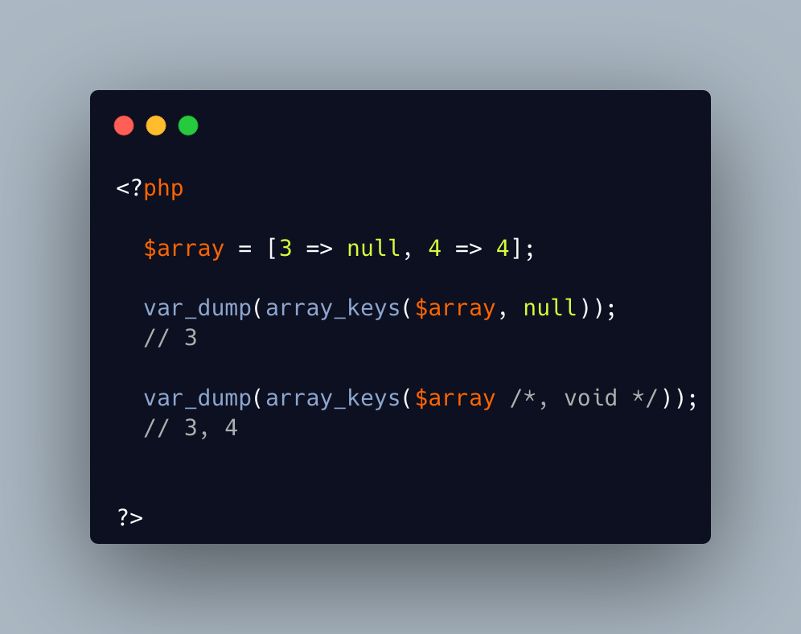

.. _void-parameter-in-array_keys():

Void Parameter In array_keys()
------------------------------

.. meta::
	:description:
		Void Parameter In array_keys(): There is a 'void' parameter in PHP.
	:twitter:card: summary_large_image
	:twitter:site: @exakat
	:twitter:title: Void Parameter In array_keys()
	:twitter:description: Void Parameter In array_keys(): There is a 'void' parameter in PHP
	:twitter:creator: @exakat
	:twitter:image:src: https://php-tips.readthedocs.io/en/latest/_images/void_parameter.png
	:og:image: https://php-tips.readthedocs.io/en/latest/_images/void_parameter.png
	:og:title: Void Parameter In array_keys()
	:og:type: article
	:og:description: There is a 'void' parameter in PHP
	:og:url: https://php-tips.readthedocs.io/en/latest/tips/void_parameter.html
	:og:locale: en

.. raw:: html

	

There is a 'void' parameter in PHP. It is the second argument of array_keys().

That second parameter is often omitted (and unknown). 

If present, it is typed 'mixed' to allow any value to be searched (here, null). 

If absent, array_keys() returns ALL keys. When absent, it is not null, nor any other type. The last one possible is 'void' 

Type is then : void|mixed.

See Also
________

* `null as a parameter <https://3v4l.org/3JsR4>`_ [Try me]

PHP Features
____________

* `null <https://php-dictionary.readthedocs.io/en/latest/dictionary/null.ini.html>`_

* `void <https://php-dictionary.readthedocs.io/en/latest/dictionary/void.ini.html>`_

* `parameter <https://php-dictionary.readthedocs.io/en/latest/dictionary/parameter.ini.html>`_

