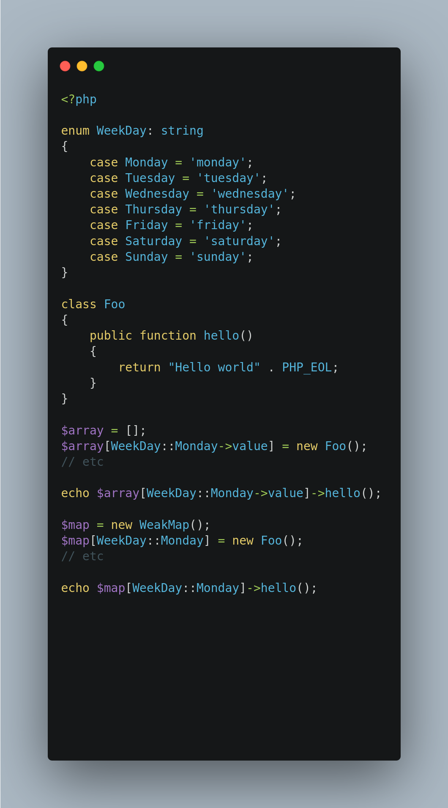

.. _weakmap-and-enums:

Weakmap And Enums
-----------------

.. meta::
	:description:
		Weakmap And Enums: Have been reminded by a fellow PHP dev that, instead of a simple array, one could also use ``WeakMap``.
	:twitter:card: summary_large_image
	:twitter:site: @exakat
	:twitter:title: Weakmap And Enums
	:twitter:description: Weakmap And Enums: Have been reminded by a fellow PHP dev that, instead of a simple array, one could also use ``WeakMap``
	:twitter:creator: @exakat
	:twitter:image:src: https://php-tips.readthedocs.io/en/latest/_images/weakmap.png
	:og:image: https://php-tips.readthedocs.io/en/latest/_images/weakmap.png
	:og:title: Weakmap And Enums
	:og:type: article
	:og:description: Have been reminded by a fellow PHP dev that, instead of a simple array, one could also use ``WeakMap``
	:og:url: https://php-tips.readthedocs.io/en/latest/tips/weakmap.html
	:og:locale: en

.. raw:: html

	

By `Dmitri Goosens <https://phpc.social/@dgoosens>`_

Have been reminded by a fellow PHP dev that, instead of a simple array, one could also use ``WeakMap``...

Nice thing with this is that it is a real dictionary... and that it accepts objects as keys... and this includes ``Enum::case``.

See Also
________

* `Original toot <https://phpc.social/@dgoosens/115218594712012421>`_
* `Weakmap <https://www.php.net/manual/en/class.weakmap.php>`_
* `Weakmap in action <https://3v4l.org/cji28>`_ [Try me]

PHP Features
____________

* `weakmap <https://php-dictionary.readthedocs.io/en/latest/dictionary/weakmap.ini.html>`_

* `enum <https://php-dictionary.readthedocs.io/en/latest/dictionary/enum.ini.html>`_

* `array <https://php-dictionary.readthedocs.io/en/latest/dictionary/array.ini.html>`_

