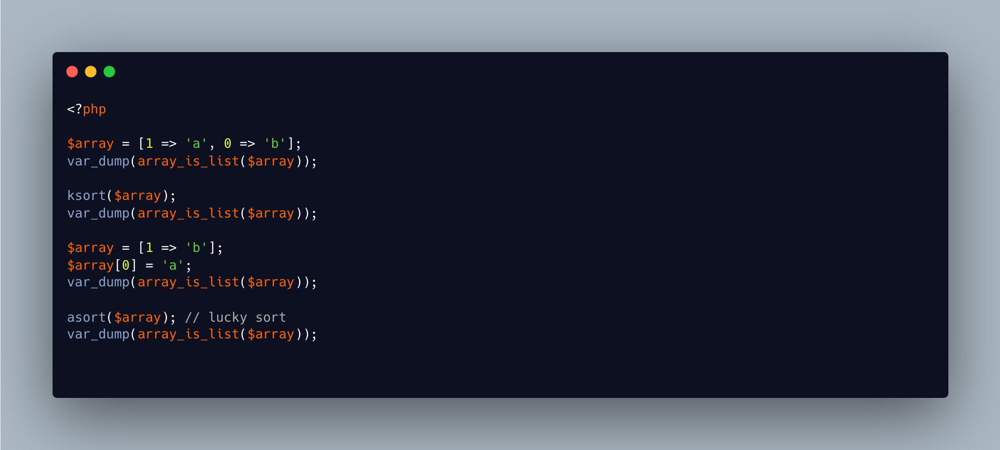

.. _what-array-is-a-list:

What Array Is A List
--------------------

.. meta::
	:description:
		What Array Is A List: array_is_list() was introduced in PHP 8.
	:twitter:card: summary_large_image
	:twitter:site: @exakat
	:twitter:title: What Array Is A List
	:twitter:description: What Array Is A List: array_is_list() was introduced in PHP 8
	:twitter:creator: @exakat
	:twitter:image:src: https://php-tips.readthedocs.io/en/latest/_images/what_array_list.png
	:og:image: https://php-tips.readthedocs.io/en/latest/_images/what_array_list.png
	:og:title: What Array Is A List
	:og:type: article
	:og:description: array_is_list() was introduced in PHP 8
	:og:url: https://php-tips.readthedocs.io/en/latest/tips/what_array_list.html
	:og:locale: en

.. raw:: html

	

array_is_list() was introduced in PHP 8.1, and tells if an array is a list: an array is considered a list if its keys consist of consecutive numbers from 0 to ``count($array)-1``.

There are some edge cases: first, array_is_list() is sensible to insert order: give the right indices in the wrong order, say 1 is inserted before 0, and the resulting array is not a list.

You can then turn that array into an actual list by using ksort(), asort() or sort(), which checks the keys while sorting the array.

Finally, the best way to make the array a list is array_values().

See Also
________

* `array_is_list() and sorting <https://3v4l.org/eNYsj#v8.5.7>`_ [Try me]

PHP Features
____________

* `array <https://php-dictionary.readthedocs.io/en/latest/dictionary/array.ini.html>`_

* `array_is_list <https://php-dictionary.readthedocs.io/en/latest/dictionary/array_is_list.ini.html>`_

* `index-array <https://php-dictionary.readthedocs.io/en/latest/dictionary/index-array.ini.html>`_

