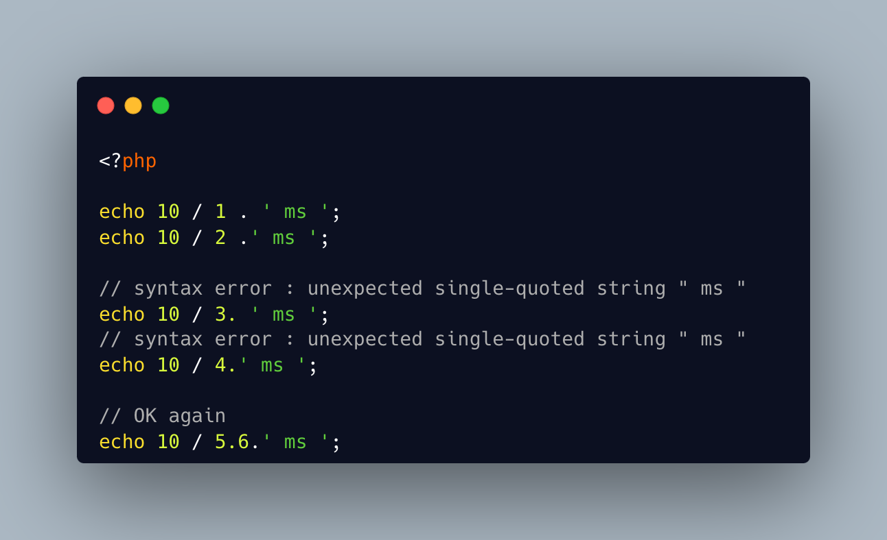

.. _when-space-matters:

When Space Matters
------------------

	.. meta::
		:description lang=en:
			When Space Matters: The two first echo are valid, because there is a space between the integer and the dot : PHP interpret them as a concatenation.

The two first echo are valid, because there is a space between the integer and the dot : PHP interpret them as a concatenation.

The third and fourth ones are a syntax error, because PHP starts interpreting a float, but fail to get the decimal part.

Finally, the last echo is valid, because PHP managed to build a float, so it doesn't mistake the second point with another float, and use it as a concatenation.

Some edge cases of white space matters in the syntax.

