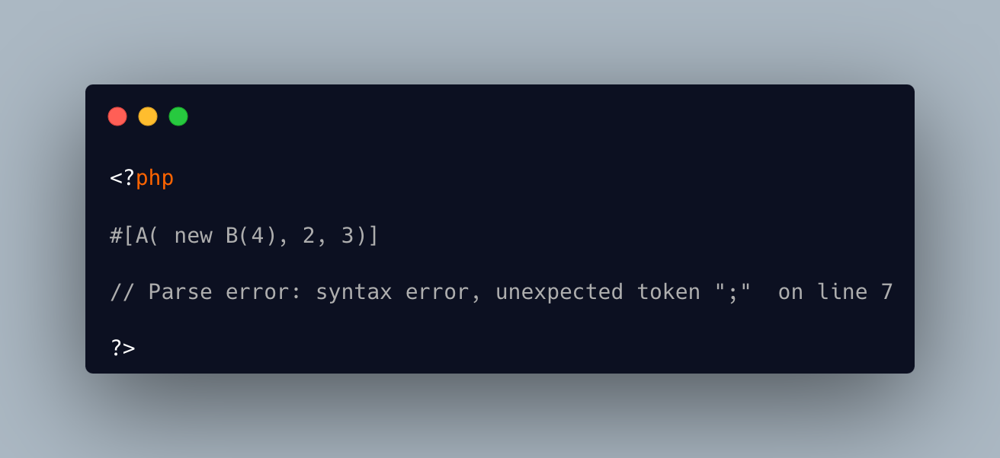

.. _where-is-the-semicolon?:

Where Is The Semicolon?
-----------------------

.. meta::
	:description:
		Where Is The Semicolon?: This code is an attribute.
	:twitter:card: summary_large_image
	:twitter:site: @exakat
	:twitter:title: Where Is The Semicolon?
	:twitter:description: Where Is The Semicolon?: This code is an attribute
	:twitter:creator: @exakat
	:twitter:image:src: https://php-tips.readthedocs.io/en/latest/_images/where-is-the-semicolon.png
	:og:image: https://php-tips.readthedocs.io/en/latest/_images/where-is-the-semicolon.png
	:og:title: Where Is The Semicolon?
	:og:type: article
	:og:description: This code is an attribute
	:og:url: https://php-tips.readthedocs.io/en/latest/tips/where-is-the-semicolon.html
	:og:locale: en

.. raw:: html

	

This code is an attribute. A attribute always expects to be followed by a structure that it will characterize. Here, without anything else to parse, the parser displays a mysterious error about a semi colon, while none is in sight.

In fact, the closing PHP tag has a built-in semi colon, to end any expression that was still open.

This is similar to another tip, that relies on echo.

See Also
________

* `No Semicolon in sight <https://php-tips.readthedocs.io/en/latest/tips/no_semi_colon_in_sight.html>`_
* ` <>`_

