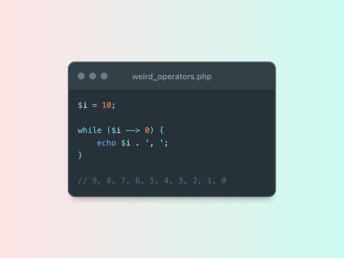

.. _strange--->-operator:

Strange --> Operator
--------------------

.. meta::
	:description:
		Strange --> Operator: This PHP code is valid.
	:twitter:card: summary_large_image
	:twitter:site: @exakat
	:twitter:title: Strange --> Operator
	:twitter:description: Strange --> Operator: This PHP code is valid
	:twitter:creator: @exakat
	:twitter:image:src: https://php-tips.readthedocs.io/en/latest/_images/while_i_--.png
	:og:image: https://php-tips.readthedocs.io/en/latest/_images/while_i_--.png
	:og:title: Strange --> Operator
	:og:type: article
	:og:description: This PHP code is valid
	:og:url: https://php-tips.readthedocs.io/en/latest/tips/while_i_--.html
	:og:locale: en

.. raw:: html

	

By `Andrew Schmelyun <https://twitter.com/aschmelyun>`_

This PHP code is valid. It works because of the way operator syntax is parsed: it's another way of writing ``while ($i-- > 0)``: the spaces are not important in this syntax. The result is a very visual way to explain what the loop is doing.

See Also
________

* `down to 0 <https://3v4l.org/bXlOC>`_ [Try me]

