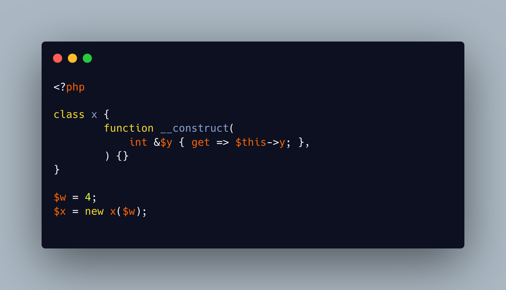

.. _who-modifies-this-property?:

Who Modifies This Property?
---------------------------

.. meta::
	:description:
		Who Modifies This Property?: Several observations in this code:.
	:twitter:card: summary_large_image
	:twitter:site: @exakat
	:twitter:title: Who Modifies This Property?
	:twitter:description: Who Modifies This Property?: Several observations in this code:
	:twitter:creator: @exakat
	:twitter:image:src: https://php-tips.readthedocs.io/en/latest/_images/who_modifies_this.png
	:og:image: https://php-tips.readthedocs.io/en/latest/_images/who_modifies_this.png
	:og:title: Who Modifies This Property?
	:og:type: article
	:og:description: Several observations in this code:
	:og:url: https://php-tips.readthedocs.io/en/latest/tips/who_modifies_this.html
	:og:locale: en

.. raw:: html

	

Several observations in this code:

it is possible to define a property without visibility: the property hook makes it a promoted property.

It is also possible possible to create a reference on a property, as promoted properties are also an argument.

When all these features are together, it yields an error about accessing an uninitialized property.

See Also
________

* `Uninitialized property <https://3v4l.org/RH1V7>`_ [Try me]

PHP Error Messages
__________________

* `Typed property x::$y must not be accessed before initialization <https://php-errors.readthedocs.io/en/latest/messages/typed-property-%25s%3A%3A%24%25s-must-not-be-accessed-before-initialization.html>`_

PHP Features
____________

* `promoted-property <https://php-dictionary.readthedocs.io/en/latest/dictionary/promoted-property.ini.html>`_

* `property-hook <https://php-dictionary.readthedocs.io/en/latest/dictionary/property-hook.ini.html>`_

* `reference <https://php-dictionary.readthedocs.io/en/latest/dictionary/reference.ini.html>`_

* `property <https://php-dictionary.readthedocs.io/en/latest/dictionary/property.ini.html>`_

