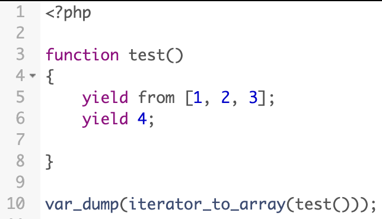

.. _yield-and-keys:

Yield And Keys
--------------

.. meta::
	:description:
		Yield And Keys: Guess the output.
	:twitter:card: summary_large_image
	:twitter:site: @exakat
	:twitter:title: Yield And Keys
	:twitter:description: Yield And Keys: Guess the output
	:twitter:creator: @exakat
	:twitter:image:src: https://php-tips.readthedocs.io/en/latest/_images/yield_and_keys.png
	:og:image: https://php-tips.readthedocs.io/en/latest/_images/yield_and_keys.png
	:og:title: Yield And Keys
	:og:type: article
	:og:description: Guess the output
	:og:url: https://php-tips.readthedocs.io/en/latest/tips/yield_and_keys.html
	:og:locale: en

.. raw:: html

	

By `Jerome Tamarelle <https://bsky.app/profile/jerome.tamarelle.net>`_

Guess the output.

See Also
________

* `Guess the output <https://3v4l.org/Oflt2>`_ [Try me]

PHP Features
____________

* `yield <https://php-dictionary.readthedocs.io/en/latest/dictionary/yield.ini.html>`_

* `yield-from <https://php-dictionary.readthedocs.io/en/latest/dictionary/yield-from.ini.html>`_

* `iterator_to_array <https://php-dictionary.readthedocs.io/en/latest/dictionary/iterator_to_array.ini.html>`_

