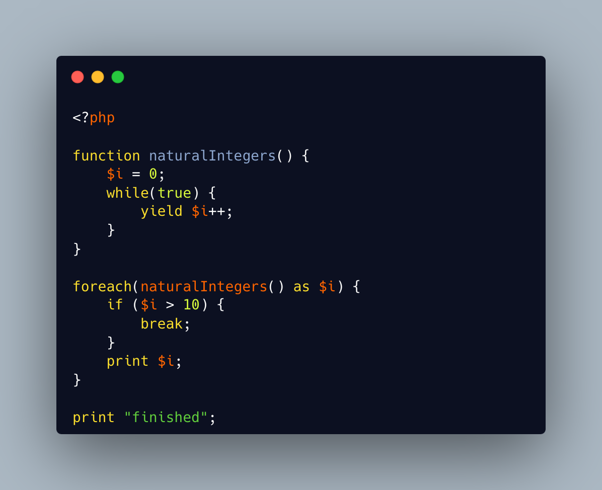

.. _cannot-yield-and-never:

Cannot Yield And Never
----------------------

.. meta::
	:description:
		Cannot Yield And Never: Never, as a return type, mentions that the method will never return.
	:twitter:card: summary_large_image
	:twitter:site: @exakat
	:twitter:title: Cannot Yield And Never
	:twitter:description: Cannot Yield And Never: Never, as a return type, mentions that the method will never return
	:twitter:creator: @exakat
	:twitter:image:src: https://php-tips.readthedocs.io/en/latest/_images/yield_cannot_never.png
	:og:image: https://php-tips.readthedocs.io/en/latest/_images/yield_cannot_never.png
	:og:title: Cannot Yield And Never
	:og:type: article
	:og:description: Never, as a return type, mentions that the method will never return
	:og:url: https://php-tips.readthedocs.io/en/latest/tips/yield_cannot_never.html
	:og:locale: en

.. raw:: html

	

Never, as a return type, mentions that the method will never return. This means that it either calls exit(), throws an exception, or is an infinite loop.

Infinite loop escaped my radar until I realized it is a good way to characterize the loop in an explicit way: put any explicit loop in a ``never`` method and know before hand of the implications.

Sadly, infinite loop work very well with Yield and yield from, but such methods must be typed with ``Generator``. Too bad.

See Also
________

* `Never (PHP manual) <https://www.php.net/manual/en/language.types.never.php>`_
* `Generators overview (PHP manual) <https://www.php.net/manual/en/language.generators.overview.php>`_
* `this function never returns <https://3v4l.org/X3KJH>`_ [Try me]

