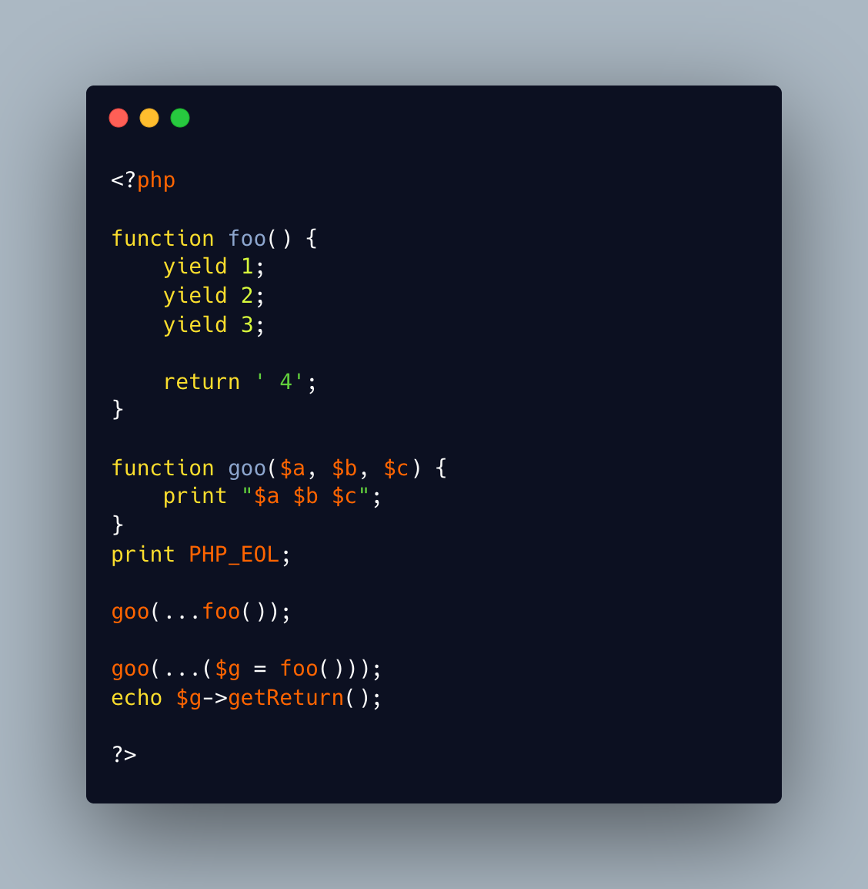

.. _yield,-not-return:

Yield, Not Return
-----------------

	.. meta::
		:description lang=en:
			Yield, Not Return: This will display ``1 2 3``.

This will display ``1 2 3``. This is because the ``...`` operator will act as a ``foreach`` and runs the generator. It will then spread the values as arguments for the function call, and, in this case, it matches the needed arguments.

Note that named parameters are also supported, with the good PHP version.

The returned value of the generator is lost, in this case. If you need to access the returned values, you must get the generator, and call the ``getReturn()`` method.

* `Generators overview (PHP manual) <https://www.php.net/manual/en/language.generators.overview.php>`_

