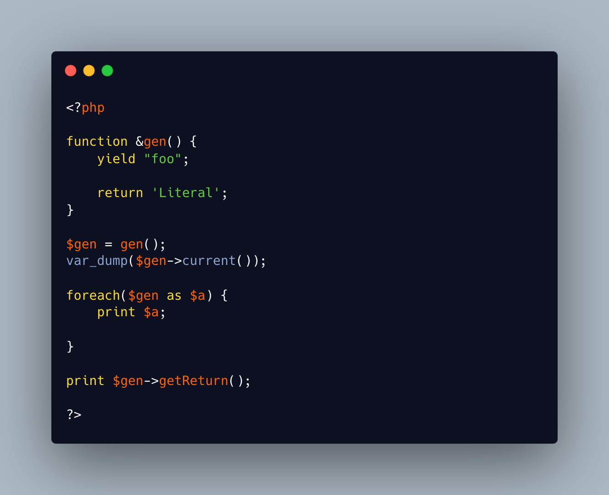

.. _yield,-not-return-by-reference:

Yield, Not Return By Reference
------------------------------

	.. meta::
		:description lang=en:
			Yield, Not Return By Reference: When a method returns a reference, there is a ``&`` before its name, in the signature.

When a method returns a reference, there is a ``&`` before its name, in the signature. This means that the function must return a variable, or a property, and not a literal value.

When the same ``&`` is added on a generator, this now means that the yielded values are by reference. On the other hand, the returned value mat be a literal value, without generating a warning.

* `Generator syntax <https://www.php.net/manual/en/language.generators.syntax.php>`_
* `Returning value <https://www.php.net/manual/en/functions.returning-values.php>`_

