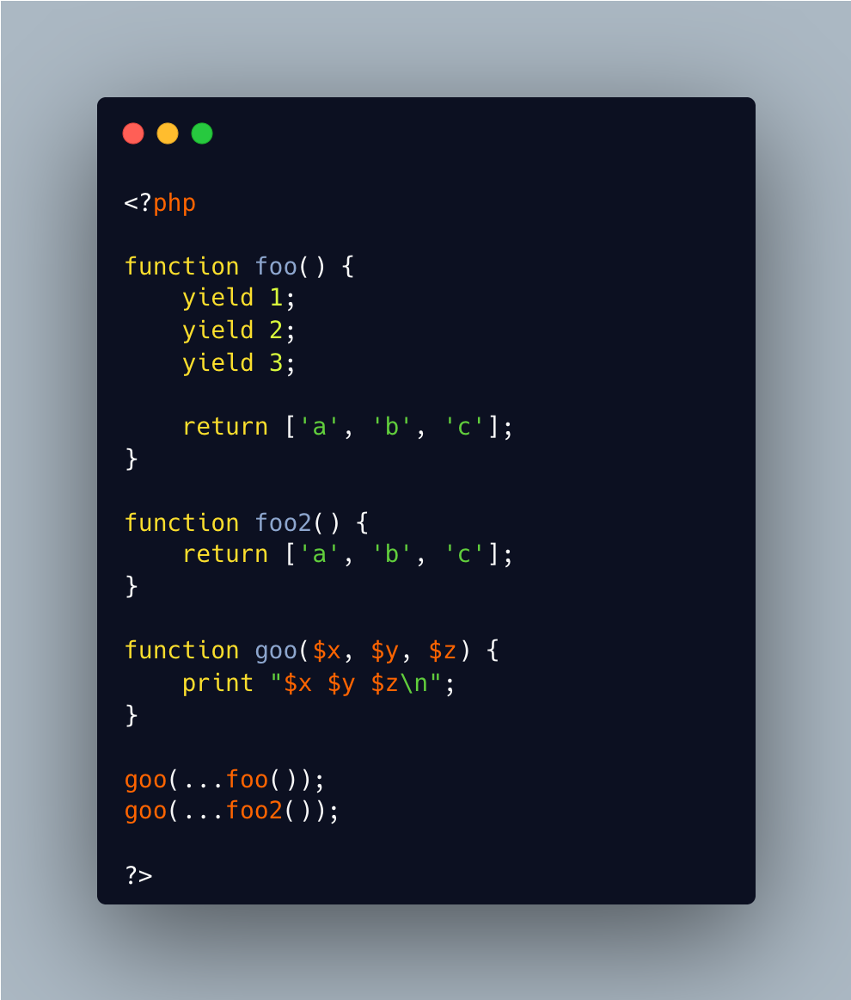

.. _yield-or-return:

Yield Or Return
---------------

.. meta::
	:description:
		Yield Or Return: It is possible to spread an array as dynamic arguments: this applies to returned arrays, after a function call.
	:twitter:card: summary_large_image
	:twitter:site: @exakat
	:twitter:title: Yield Or Return
	:twitter:description: Yield Or Return: It is possible to spread an array as dynamic arguments: this applies to returned arrays, after a function call
	:twitter:creator: @exakat
	:twitter:image:src: https://php-tips.readthedocs.io/en/latest/_images/yield_or_return.png
	:og:image: https://php-tips.readthedocs.io/en/latest/_images/yield_or_return.png
	:og:title: Yield Or Return
	:og:type: article
	:og:description: It is possible to spread an array as dynamic arguments: this applies to returned arrays, after a function call
	:og:url: https://php-tips.readthedocs.io/en/latest/tips/yield_or_return.html
	:og:locale: en

.. raw:: html

	

It is possible to spread an array as dynamic arguments: this applies to returned arrays, after a function call.

The function call may be actually of two types: function or a generator.

The first type is a generator: then, the yielded values are used as argument and the returned array is ignored.

In the second case, the array is returned and used.

See Also
________

* `Array or yield? <https://3v4l.org/lS3WS#v>`_ [Try me]

PHP Features
____________

* `generator <https://php-dictionary.readthedocs.io/en/latest/dictionary/generator.ini.html>`_

* `array-spread <https://php-dictionary.readthedocs.io/en/latest/dictionary/array-spread.ini.html>`_

* `array <https://php-dictionary.readthedocs.io/en/latest/dictionary/array.ini.html>`_

* `argument <https://php-dictionary.readthedocs.io/en/latest/dictionary/argument.ini.html>`_

